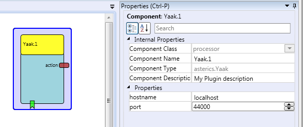

# Yaak

Component Type: Processor

Yaak is a flexible on-screen-keyboard for the Android operating system. More information can be found in the pdf documentation in the Android/Yaak folder within the release package.

Yaak plugin in the ACS

## Requirements

*   The Android based mobile device running Yaak must be connected to the AsTeRICS system over a TCP/IP connection and the used port must not be blocked by a firewall

## Output Port Description

*   **action \[string\]:** gives the action string whenever a button of the keyboard gets triggered. The string for each button can be stored in the xml layout for the keyboards.

## Properties

*   **hostname \[string\]:** The hostname of the mobile device (IP or hostname is valid)
*   **port \[integer\]:** The port Yaak listens for incoming messages. This can be set in the xml file of a keyboard.