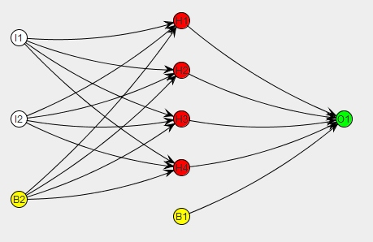
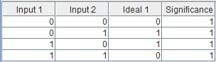

# Create Encog EG file

This document describe how to create sample [Encog framework][1] EG file that store neural network. The example shown how to create the basic neural network that performs XOR operation.

1.  Download the encog-workbench-3.0.1-release.zip package from the [Encog page][2], unzip it and run the Encog Workbench using command: "java -jar encog-workbench-3.0.1-executable.jar". Create new folder for the project.
  
3.  To create Neural network, select "File > New file...". Select: the "Machine Learning Method (\*.eg)" and enter name of the EG file. Then, select the "Feedforward Neural Network" and click OK. On the next window, enter 2 into the "Input Neuron Count" text box. Click Add and enter 4 neurons for the hidden layer. enter 1 into the "Output Neuron Count" text box. Change the Activation Function Hidden and Activation Function Output to the Activation Sigmoid. Then, click OK.
  

The structure of the neural network

  
7.  Next step is to create the Training File. Select "File > New file...". Select: "Training File (\*.egb)" and enter name of the EGB file. Click OK. On the next window, enter 4 into the the "Training Set Elements" text box, enter 2 into the "Input Field Count" text box, enter 1 into the "Output Field Count" text box. Click OK. Click on the file and fill the table for the XOR operation.
  

The training set

  
11.  When the training set is ready, the neural network can be trained. Click on the neural network file and choose the "Train" option. In the Training Set select the training file, in the Neural Network select the neural network file and click OK. Select the Propagation - Resilient (RPROP) training method and click OK. Enter 0.01 into the Maximum Error Percent(0-100) box, choose the RPROP type: "RPROP+ (classic)" and click OK. Click the Start button to Train the network. When the Max Error is reached click Close.

  
The neural network file can be loaded by the [Neural Network Loader][3] plugin.To load the neural network, enter the EG file path into the filePath plugin property. For this example, the input1 input port and the input2 input port will send the input data for the neural network and the output1 output port will give the XOR operation result.  

[1]: http://www.heatonresearch.com/encog
[2]: http://www.heatonresearch.com/encog
[3]: NeuralNetworkLoader.htm