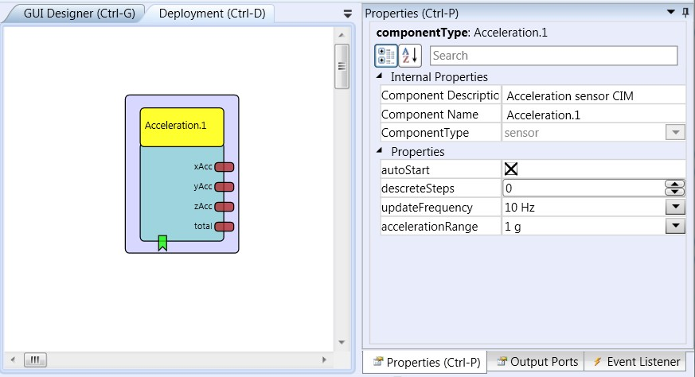
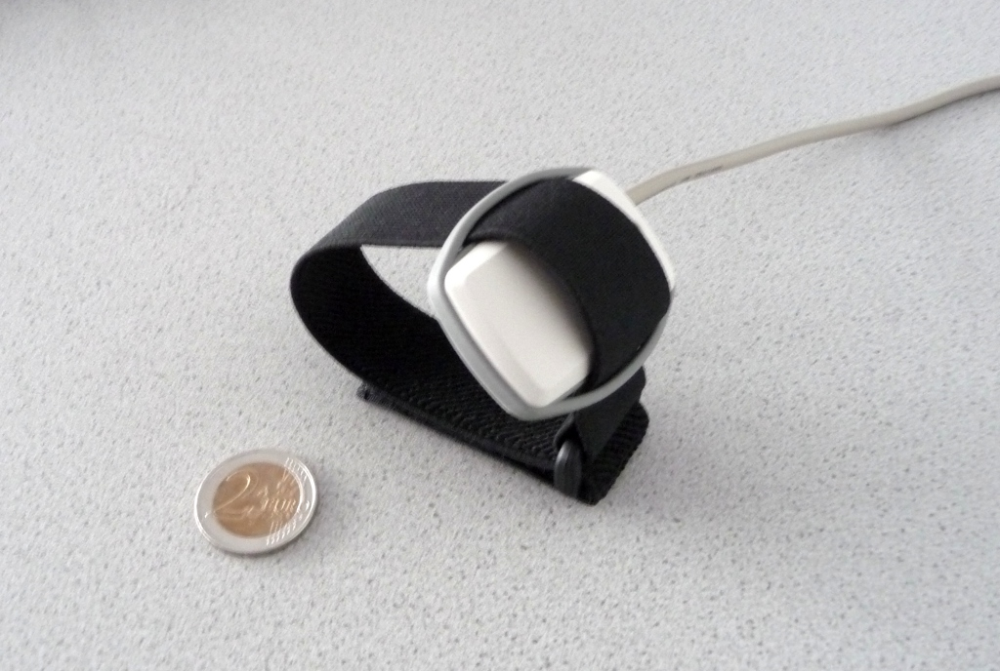

# Acceleration

Component Type: Sensor (Subcategory: Inertial Measurement)

The Acceleration input component is a sensor which is used in combination with the Acceleration CIM created in the course of the AsTeRICS project. The component provides three output ports which provide acceleration values for x, y and z axis. Via the component properties, the sampling rate and the sensitivity (acceleration range) can be set.

Acceleration plugin

## Requirements

This software component requires an Acceleration CIM (CIM ID: 0x0501) connected to the platform.

Acceleration CIM (preliminary version)

## Output Port Description

*   **xAcc \[double\], yAcc \[double\], zAcc \[double\]:** These three output ports provide actual acceleration values of the X-, Y- and Z axis. The values are updated as a new data packet comes in (the sampling rate is set via the property update\_frequency.
*   **total \[double\]:** This output port provides the total acceleration value, calculated by the square root of (x\*x + y\*y + z\*z).

## Event Listener Description

*   **start:** An incoming event on this port starts the Acceleration CIM. (If the property autostart is set, the CIM is started automatically when the model is started).
*   **stop:** An incoming event on this port stops the Acceleration CIM.
*   **calibrate:** An incoming event on this port samples the current values of X, Y and Z axis and stores them as new "offset values". These offset values are subtracted from the incoming x, y and z values. Please note that this is not a real calibration of the sensor, but can set a baseline for the output values to zero, for example when the sensor is in resting pose.

## Properties

*   **autoStart \[boolean\]:** This property specifies if the Acceleration CIM shall be started together with the model (if value is true) or if the Acceleration CIM receives a sepertate start condition via the dedicated event listener port (if value is false).
*   **discreteSteps \[integer\]:** If this property has a positive value greater than zero, the effective range of values for the X,Y and Z axis (-8192 to 8192) is mapped to a smaller number of values given by the property. For example: If he value is 10, the whole range of acceleration is mapped to values from -5 to 5. This can be helpful if a small number of different values is desired, e.g. for controlling the mouse cursor speed.
*   **updateFrequency \[integer\]:** This property defines the bandwidth of the acceleration sensor - and respectively the update rate of acceleration values on the output ports. The update rate is twice as fast as the selected bandwidth. The bandwidth can be selected as 10Hz, 20Hz, 40Hz, 75Hz, 150Hz or 300Hz. This means that if a bandwidth of 40Hz is selected, the x, y and z values are updated 80 times per second and frequencies up to 40 Hz can be measured with the acceleration sensor. Values of 20 Hz to 75 Hz are recommended for normal operation where body movements are measured (the highest possible frequency - 300Hz - can cause performance troubles in the current platform implementation because the update rate of 600 times per second is too fast).
*   **accelerationRange \[integer\]:** This property defines the sensitivity of the acceleration sensor (the measureable range of acceleration, defined in g). The range can be selected as 1g, 1.5g, 2g, 3g, 4g, 8g or 16 g via the combo box selection in the ACS. The selected acceleration range is mapped to values of -8192 to 8192 on the output ports. A value of 3 g is recommended for normal operation where body movements are measured.