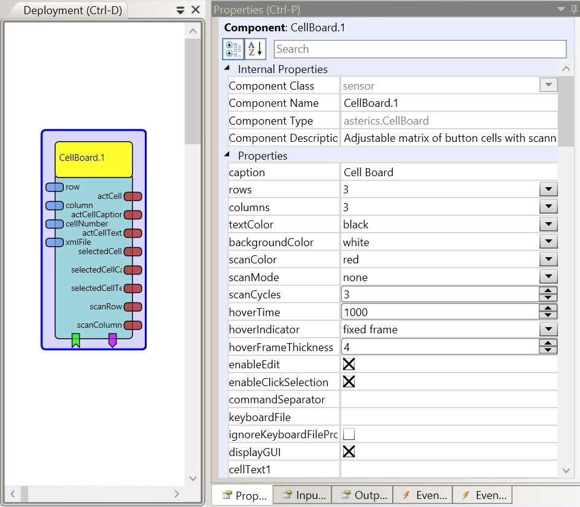
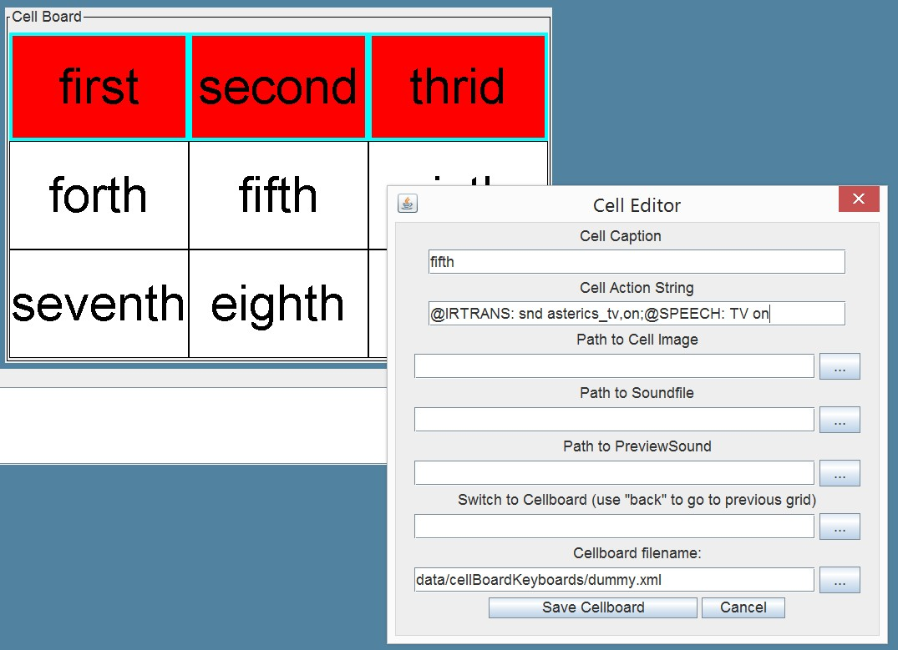

# CellBoard

Component Type: Sensor (Subcategory: Graphical User Interface)

The CellBoard plugin is a GUI plugin which can display a panel with multiple cells. It can be used as a simple on-screen keyboard. Each cell can contain text and a picture, and it can provide acoustic feedback on selection. Cells can emit command strings and sounds or switch to other cellboards (which can be stored as .xml files). The CellBoard plugin provides basic scanning options (to select a cell via a stepwise process). It also provides a small editor for designing the cells and saving the whole cellboard grid as an .xml file.

CellBoard plugin

## Using the cell editor

The cell editor can be opened by right-clicking a cell. (This option can be enabled/disabled by using the property "enableEdit"). The cell editor allows to define the content of a cell (cell caption, action string, cell image and sounds for cell-selection or acoustic preview during cell scanning). "Switch to Cellboard" allows to specify a cellboard grid which will be loaded when this cell is selected. When "back" is entered here, the previously loded cellboard will be restored. Thus, complex communication/selection grids can be layered. The whole current cellboard is saved as an .xml file when "Save Cellboard" is clicked. Existing .xml files can be selected to be loaded on startup via the "keyboardFile"-property of the cellboard plugin in the ACS property editor.

CellBoard editor

## Input Port Description

*   **row \[integer\]:** This port can be used in "directed scanning" mode to set the row of the highlighted cell.
*   **column \[integer\]:** This port can be used in "directed scanning" mode to set the column of the highlighted cell.
*   **cellNumber \[integer\]:** This port can be used in "directed scanning" mode to set the number of the highlighted cell.
*   **xmlFile \[string\]:** Name of a keyboard file (default location in data/cellBoardKeyboards) which can be loaded or saved. A load operating can be triggered via the dedicated event listener port.

## Output Port Description

*   **actCell \[integer\]:** Sends the number of the currently scanned cell.
*   **actCellCaption \[string\]:** Sends the cell caption of the currently scanned cell.
*   **actCellText \[string\]:** Sends the action string of the currently scanned cell
*   **selectedCell \[integer\]:** Sends the number of the selected cell.
*   **selectedCellCaption \[string\]:** Sends the cell caption of the selected cell.
*   **selectedCellText \[string\]:** Sends the action string of the currently active cell
*   **scanRow \[integer\]:** Sends the number of the currently scanned row (in row/column scanning mode)
*   **scanColumn \[integer\]:** Sends the number of the currently scanned column (in row/column scanning mode)

## Event Listener Description

*   **scanMove:** Moves the scanning highlight frame in the row-column and column-row scanning modes.
*   **scanSelect:** Selects the highlighted cell in the row-column, column-row and directed scanning modes.
*   **moveUp:** Moves the scanning highlight up in the directed scanning mode (wrap around is possible).
*   **moveRight:** Moves the scanning highlight to the right in the directed scanning mode (wrap around is possible).
*   **moveLeft:** Moves the scanning highlight to the left in the directed scanning mode (wrap around is possible).
*   **moveDown:** Moves the scanning highlight down in the directed scanning mode (wrap around is possible).
*   **load:** loads a keyboard from the given xml-filename (property "keyboardFile").

## Event Trigger Description

*   **cellClicked:** This event is triggered when one of the cells is clicked.
*   **scanCancel:** This event is triggered when the row/column scanning process is cancelled because the maximum number of scan cycles has been reached.
*   **cell1...cell36:** This event is triggered when the given cell is selected.

## Properties

*   **caption \[string\]:** The component caption.
*   **rows \[integer\]:** The number of the cell rows (1-36, rows x cols <= 100).
*   **columns \[integer\]:** The number of the cell columns (1-36, rows x cols <= 100).
*   **textColor \[integer\]:** The color of the cell text.
*   **backgroundColor \[integer\]:** The color of the cell background.
*   **scanColor \[integer\]:** The color of the scanning highlighting.
*   **scanMode \[integer\]:** This property defines the scanning mode:
    *   _"none":_ The board is not scanned. Users can select the cell by clicking on it.
    *   _"row-column":_ In this mode, rows of the cells are scanned. When the user selects the row, cells in the row are scanned. The scanning frame can be moved using the scanMove event port. The row and the cell itself can be selected using the scanSelect event port.
    *   _"column-row":_ In this mode, columns of the cells are scanned. When the user selects the column, cells in the column are scanned. The scanning frame can be moved using the scanMove event port. The column and the cell itself can be selected using the scanSelect event port.
    *   _"directed":_ In this mode only one cell is highlighted. The user can move the scan highlighting via the moveUp, moveRight, moveLeft or moveDown event ports or the row, cellNumber and column input ports. The cell can be selected using the scanSelect event port.
    *   _"hover selection":_ In this mode the user can select the cell by hovering the mouse pointer above the cell.
*   **scanCycles \[integer\]:** This parameter is used in "row/column scanning" mode. After the number of scan cycles is reached, the scanning switches back to the highest level.
*   **hoverTime \[integer\]:** This parameter is used in "hover selection" mode. It defines the time of hovering needed to select the cell (in milliseconds).
*   **hoverTimeIndicator \[integer\]:** This parameter adjusts the way a hover selection prgress is indicated to the user:
    *   _"fixed frame":_ No graphical indication - the frame of the currently active cell is shown but does not change.
    *   _"growing frame":_ The frame of the active cell is growing until the value of property "hoverSelectionThickness" is reached - then the cell is selected.
    *   _"backgorund color":_ The background color of the cell changes slowly from the selected "backgroundColor" to the selected "scanColor" - then the cell is selected.
*   **hoverFrameThickness \[integer\]:** Maximum thickness of the cell frame (only valid for the hover selection mode with indicator "growing frame").
*   **enableEdit \[boolean\]:** If selected, the cells can be right-clicked to display the cell editor, which also allows to save the xml-keyboard file.
*   **enableClickSelection \[boolean\]:**If selected, all cells can be selected via a left click, regardless of the scanning process
*   **commandSeparator \[string\]:**If a character (or characters) are specified here, they will be used to tokenize the cell text which is sent to the "selectedCellText" output port when teh cell is selected. This can be used to send multiple strings (seperately) to this output port. In the example screenshot above, a semicolon (";") is used to send two different action string to the output port when the cell is selected. A "StringFilter" plugin can then be used to route these commands to different plugins.
*   **keyboardFile \[string\]:** Name of a cellboard .xml file (the sugeested files are located in folder data/cellBoardKeyboards or in folder "models"). This file will be loaded at startup of the model. If no file is specified, only the cell contents defined via the ACS editor will be available.**Supports value suggestions for existing xml-files from the ARE (dynamic property)**
*   **ignoreKeyboardFileProperties \[boolean\]:** If selected, the general cellboard parameters (rows/columns/colors/scan mode etc.) will be kept as defined via the ACS editor when a cellboard .xml file is loaded. If not selected, these parameters will be loaded from the .xml file, thereby overriding the values defined in the ACS editor.
*   **dispayGUI \[boolean\]:** If selected, the component will be displayed in the ARE GUI. Otherwise the componentent will be hidden !

The following properties will be overwritten if cellboard .xml files are loaded:

*   **cellText1...cellText36 \[string\]:** The text displayed on the cell.
*   **cellImage1...cellImage36 \[string\]:** The path of the image displayed on the cell.
*   **actionText1...actionText36 \[string\]:** The text sent through the selectedCellText output port, when the cell is selected.