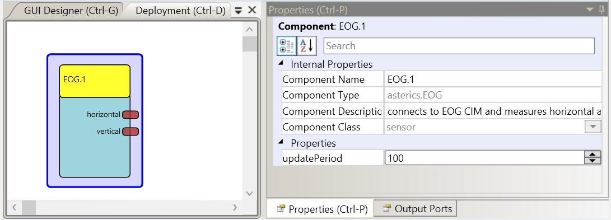

# EOG

### Component Type: Sensor (Subcategory:Sensor Modules)

This component provides the EOG signal (electro-oculogram) from the EOG sensor board, which has been developed in course of the Bachelor theses of Benedikt Rossboth at the UAS Technikum Wien. The EOG sensor board delivers information about eye movements and eye blinks which can be used in alternative user input setups.

For operation, three surface electrodes must be fixed to the users head (one electrode aside and above one eye, and one DRL electrode e.g. at the wrist of the user). In a proof-of-concept model, a musical instrument was implemented where a user can control midi tones via eye movements. For detailed information please refer to the file Documentation/DIYGuides/EOG_Rossboth.pdf

  
the EOG sensor plugin

## Requirements

The EOG sensor has to be connected to a USB port. The design documentation of the electronic circuit can be found in the thesis pdf. The firmware for the EOG sensor's microcontroller is available in the folder CIMs/EOG_CIM. The image below shows the breadboard setup of the circuit and a measurement of 6 eye blinks (above) and a left/right eye movement (below).

  
EOG sensor application

## Output Port Description

- **horizontal \[integer\]:** the currently measured horizontal eye movement value
- **vertical \[integer\]:** the currently measured vertical eye movement value

## Properties

- **updatePeriod \[integer\]:** the update period for values in milliseconds.
