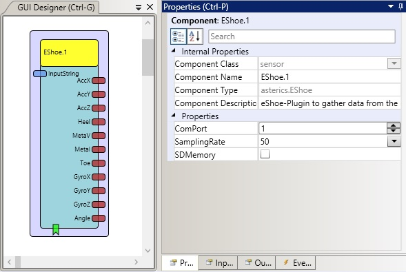
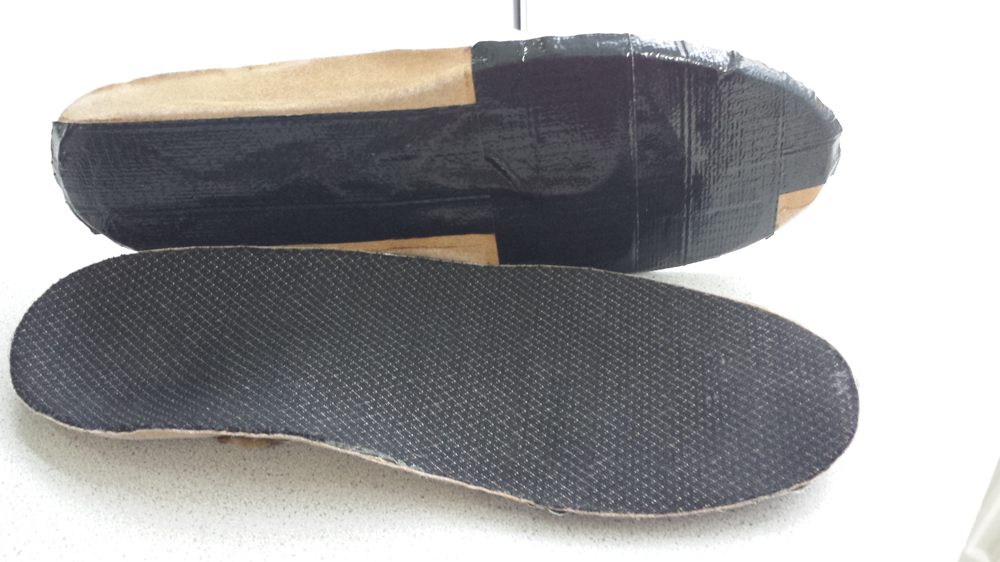
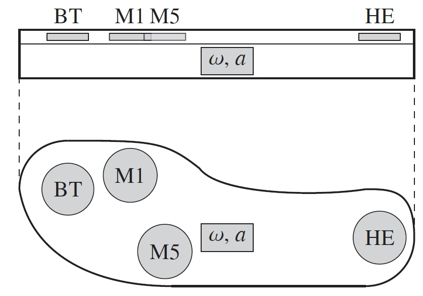

# EShoe

Component Type: Sensor (Subcategory: Sensor Modules)

This component provides an interface to the eShoe which is an insole for shoes with sensor inlays, capabale of measuring multiple degrees of freedom (pressure, acceleration and angular velocity) for gait analysis and rehabilitation purposes. See: [eShoe-info (german)][1]. The COM Port number for the device must be specified in the plugin properties.

EShoe plugin

## Requirements

This software component requires an EShoe connected via Bluetooth to a COM Port.

Picture of the EShoe

Schematic view of the EShoe (left insole), light grey circles mark pressure sensors (big toe (BT), metatarsal head I (M1), metatarsal head V (M5), heel (HE)), the grey box marks the positon of the triaxial acceleration sensor (a) and triaxial gyroscope (ω).  
V. David, H. Jagos, S. Litzenberger, and M. Reichel, "Instrumented insole for mobile and long distance motion pattern measurement," Procedia Eng., vol. 34, pp. 760-765, 2012.

## Output Port Description

- **Channel1 to Channel3 \[Short\]:** Output of the acceleration in X, Y and Z direction. The values range for -1285,81632m/s² to 1285,77708m/s².
- **Channel4 to Channel7 \[Unsigned Short\]:** Output of the pressure sensors of heel, metaV, metaI and toe. The unit of the output data is gram.
- **Channel8 to Channel10 \[Short\]:** Output of the gyroscope in X, Y and Z direction. The values range for -2280,6528°/s to 2280,5832°/s.
- **Channel11 \[Short\]:** This is the angle between subsurface and insole of the users foot. The values range for -327,68° to 327,67°.

## Properties

- **COMPort \[String\]:** The name of the COM port, for example COM2 or COM17.
- **SamplingRate \[Integer\]:** The sampling rate of the eShoe. Could be chosen between 50Hz and 200Hz.
- **SDMemory \[Boolean\]:** The storage on the SD card in the eShoe can be turned on if checked.

[1]: http://deutsch.ceit.at/ceit-raltec/projekte/aal---eshoe
