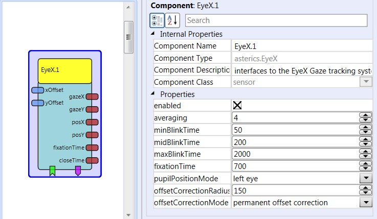
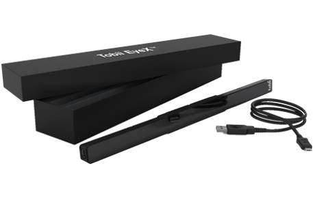

# EyeX

Component Type: Sensor (Subcategory: Computer Vision)  
  
OS: Windows

This component provides access to the raw gaze tracking data from [Tobii eye tracking devices][1]. The data includes the estimated gazepoint (x/y), the eye location (x/y), fixation time and eye close time. The plugin connects to the device via the Tobii SDK.

Currently the following devices should work:

*   [Tobii EyeX][2]
*   [Tobii Tracker 4C][3]: Also supports head tracking and can be combined with the [Tobii4CHeadTracker][4] plugin to get eye gaze and head pose data.
*   [Steel Series Sentry][5] (not tested)

Tobii EyeX plugin

## Requirements

*   OS: Windows
*   USB port: The Tobii EyeX device needs a USB3.0 port, the Tracker 4C needs at least a USB 2.0 port. Preferably don't use a USB hub, or only use a [recommended hub from Tobii][6].
*   [Tobii Eye Tracking Core Software][7] must be installed and running.

Tobii EyeX hardware

## Output Port Description

*   **gazeX \[integer\]:** The x-coordinate of the estimated gazepoint on the computer screen (in pixels)
*   **gazeY \[integer\]:** The y-coordinate of the estimated gazepoint on the computer screen (in pixels)
*   **posX \[integer\]:** The x-coordinate of the eye pupil(s) - left / right / both pupils can be selected via property
*   **posY \[integer\]:** The y-coordinate of the eye pupil(s) - left / right / both pupils can be selected via property
*   **fixationTime \[integer\]:** The time period for fixation of a particular spot on the screen
*   **closeTime \[integer\]:** The time period for closing both eyes (or eye tracking signal lost)

## Event Listener Description

*   **offsetCorrection:** when offset correction mode "CorrectionSpots" is selecte, an new correction spot can be added via this event. When the event is triggered, the plugin stops the output of x/y coordinates for several seconds, where the user has time to fix the exact cursor position with the eyes, thereby defining the x/y correction offset.
*   **removeLastOffsetCorrection** when this event is triggered, the last offset correction spot will be removed - useful if the offset correction did not work as intended.
*   **stopOffsetCorrection** when this event is triggered, any offset correction mode is stopped.
*   **createAndCalibrateGuestProfile** creates a new guest profiles and initiates calibration.
*   **calibrateCurrentProfile** initiates calibration of the currently active profile.
*   **switchToOffsetCorrectionSpots** selects uses multiple correction spot which can be added via envet "offsetCorrection".
*   **switchToPermanentOffsetCorrection** permanently adds the input port values of xOffset and yOffset to the gazepoint.
*   **switchToCombinedOffsetCorrection** uses the xOffset / yOffset input port values to fine-tune the gazePoint (this switches off gaze-updates until a certain gaze offset is detected.)
*   **activate** activates the eye tracker.
*   **deactivate** deactivates the eye tracker.

## Event Trigger Description

*   **blink:** triggered if the eye detection is lost for a timespan bigger than minBlinkTime and lower than midBlinkTime. This can be used for a single eye-blink detection.
*   **longBlink:** triggered if the blob detection is lost for a timespan bigger than midBlinkTime and lower than maxBlinkTime. This can be used for a long eye-blink detection.
*   **fixation:** triggered if the user looks at a particular location on the screen for longer than defined in via the fixationTime property.
*   **fixationEnd:** triggered if the user looks stops looking at a particular location (which triggered a fixation event).

## Properties

*   **enabled \[boolean\]:** selects if the eyetracker is enabled on startup of the model.
*   **averaging \[integer\]:** selects the size of an internal averager for the gaze point x/y values.
*   **minBlinkTime \[integer\]:** the minimum time for a short blink to be detected (a short blink is detected if the blink time is bigger than minBlinkTime and lower than midBlinkTime.)
*   **midBlinkTime \[integer\]:** the time for seperating short blinks from long blinks.
*   **maxBlinkTime \[integer\]:** the maximum time for a short blink to be detected (a long blink is detected if the blink time is bigger than midBlinkTime and lower than maxBlinkTime..
*   **fixationTime \[integer\]:** the minimum time for triggereing a fixation event when the user looks at a particular spot on the screen
*   **pupilPositionMode \[combobox\]:** selects the mode for calculation of the eye position output port values. (left eye / right eye or an average of both eyes)
*   **offsetCorrectionRadius \[integer\]:** defines the distance to an offset correction point where this offset correction points starts to influece the eye coordinates (see description below)
*   **offsetCorrectionMode \[combobox\]:** selects the mode for the offset correction. (correction spots, permanent offset correction or combined correction)

### Calibration and Offset Correction

*   A sucessful gaze estimation needs prior calibration. This should be done using the application/GUI provided by the Tobii EyeX software, but can also be accomplished by the provided event listeners.
*   The **offset correction** modes allow application of drift correction during normal operation of the eye tracking. This is useful when certain locations on the screen cannot be reached because of a calibration problem but a new calibraiton is either not desired or not successful / precise enough. The goal of the offset correction is to reduce the error between the real gaze point and the estimated (weak) gaze point where usually the cursor is positioned, by adding small offset values.

There are three offset correction modes provided, which can be chosen via the **offsetCorrectionMode** property or the respective events:

*   offset correction spots
when a new spot is set via the provided event listener, eye tracking is stopped for several seconds. Look at the cursor. After 1 second, the offest is measured. When the tracking starts again, the measured offset is applied in the area of the selected offsetCorrectionRadius. Here, linear approximation is used, so that looking at the original (weak) gaze estimation point will add the full offest value, resulting the corrected gaze estimation point. Multiple spots can be added at different screen loactions.*   permanent offset correction:
the correction values for x and y which are provided via the input ports xOffset and yOffset are permanenty added to the gazepoint location. A joystick, mouthmouse or similar input device can be used to provide these values.*   combined offset correction:
if the correction values for x and y which provided via the input ports xOffset and yOffset are not zero, the eyetracking stops and the correction values are applied to the last gazepoint. Eye-tracking starts again when the measured gazepoint differs from the corrected gazepoint by more than the selected offsetCorrectionRadius.

[1]: https://tobiigaming.com/products/
[2]: https://tobiigaming.com/product/tobii-eyex/
[3]: https://tobiigaming.com/eye-tracker-4c/
[4]: http://asterics.github.io/AsTeRICS/AsTeRICS-Help/master/Plugins/sensors/Tobii4CHeadTracker.htm
[5]: https://de.steelseries.com/gaming-controllers/sentry
[6]: https://help.tobii.com/hc/en-us/articles/212907389-Recommended-USB-2-0-hubs
[7]: https://tobiigaming.com/getstarted/