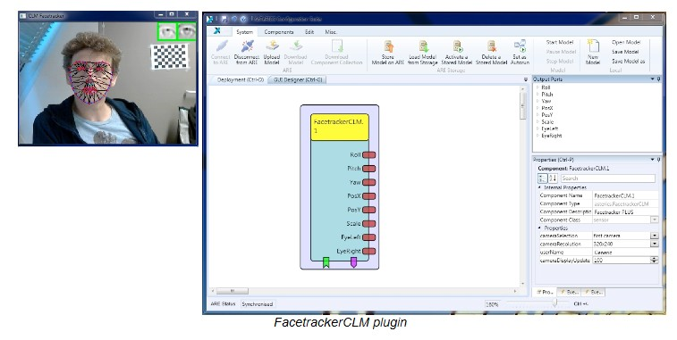

# Facetracker CLM

### Component Type: Sensor (Subcategory: Computer Vision)

The FacetrackerCLM component is one of the vision based plugin. At this stage of development it offers the same functionalities for mouse emulation as the other sensor plugin named **[facetrackerLK](FacetrackerLK.htm)** .

The underlying mechanism is based on the tracking of facial features detected in a first initialization stage by fitting a deformable face model on the image as soon as the region of interest is identified thanks to the OpenCV implementation of the Viola-Jones classifier.

The plugin outputs at each frame the relative offsets of a series of measures based on the tracked points with respect to the previous frame. These offsets may be integrated or used directly as inputs for the mouse emulator actuators. Usually it is a good idea to use the relative displacement of the centre of the face (PosX and PosY) to guide the mouse movements and reserve the other measurements or events to implement other optional functionalities (the head roll, pitch and yaw angles and relative scale of the face).

The FacetrackerCLM also introduces the detection of facial gestures that can be then exploited in the ACS models to directly perform actions or trigger events. To this purpose in this version there are two distinct event related outputs:

- Detection of the raising of both eyebrows.
- Detection of the _close_ or _open_ state of each eye.

  
FacetrackerCLM plugin

## Requirements

A camera has to be available in the operating system (preferably a consumer USB camera).

## Input Port Description

There are no input ports for this plugin.

## Output Port Description

- **Roll\[double\]:** The output port Roll outputs the relative change of the roll angle of the head pose (degrees).

- **Pitch\[double\]:** The output port Pitch outputs the relative change of the pitch angle of the head pose (degrees).

- **Yaw\[double\]:** The output port Yaw outputs the relative change of the yaw angle of the head pose (degrees).

- **PosX\[double\]:** The output port PosX outputs the relative displacement of the x coordinate (image coordinates) of the tracked point (approximatively located around the nose).

- **PosY\[double\]:** The output port PosX outputs the relative displacement of the y coordinate (image coordinates) of the tracked point (approximatively located around the nose).

- **Scale\[double\]:** The output port Scale outputs the relative change in scale of the apparent size of the fitted face model in the current image.

- **EyeLeft\[int\]:** The output port EyeLeft outputs 0 if the left eye is opened, 1 if closed in the current image.

- **EyeRight\[int\]:** The output port EyeRight outputs 0 if the right eye is opened, 1 if closed in the current image.

## Event Listener Description

- **initFace:** Forces reinit of the fitting of deformable model for the face in order to reset the tracking points.

## Event Trigger Description

- **EyebrowsRaised:** this event gets raised everytime the plugin detects a specific configuration of the facial landmarks corresponding to a _surprise_ expression.

## Properties

- **cameraSelection \[string, combobox selection\]:** this property determines the index of the input camera. Possible values range from "first camera" to "fifth camera". If only one camera is available in the system, "first camera" is the correct choice.

- **cameraResolution \[string, combobox selection\]:** this selection box provides several standard camera resolutions. Changing the resolution affects accuracy and performance (CPU load of the runtime system). Provided selections include "160x120", "320x240", "640x480" and "800x600". If the selected resolution cannot be delivered by the image acquisition device, the closest matching resolution is chosen automatically by the plugin.

- **cameraDisplayUpdate \[integer\]:** this property allows to select the update rate for the camera display in milliseconds. If "0" milliseconds is chosen, no window for the live-video will be displayed. If "100" is chosen, the live image window will be updated 10 times a second. Please note that this property does not influence the frame rate of the camera nor the processing interval for new camera frames, only the display in the GUI is adjusted.

- **userName \[string\]:** this property informs the plugin about which is the trained model to load. The actual file name is then automatically expanded as: _**userName**\_model.xlm_. The file is searched in the the FacetrackerCLM folder inside the plugin "data" folder.
