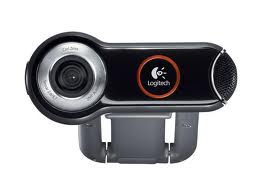

# Facetracker LK

Component Type: Sensor (Subcategory: Computer Vision)

This component provides a face tracking computer vision algorithm which puts out estimated movement of a users' nose and chin in x and y coordinates. The underlying mechanism builds upon the OpenCV library (in particular a trained cascade of haar-like features and an optical flow algorithm). The x- and y- coordinates can be used in camera-mouse configurations or to enable selection or control tasks. The values are only provided if a face can be tracked by the algorithm and are updated with the achievable frame rate. Note that the x- and y- values represent relative movement in pixels and have to be accumulated (e.g. via the integrate component) to generate e.g. absolute mouse positions.

FacetrackerLK plugin

## Requirements

A camera has to be available (this can be any webcam or a camera which is available as image acquisition device via the operating system). The picture below shows the Logitech Webcam 9000 Pro.

Logitech Webcam 9000 Pro

## Output Port Description

*   **noseX \[integer\]:** This value specifies the relative change in the x coordinate of the user's nose with respect to the previous image frame.
*   **noseY \[integer\]:** This value specifies the relative change in the y coordinate of the user's nose with respect to the previous image frame.
*   **chinX \[integer\]:** This value specifies the relative change in the x coordinate of the user's chin with respect to the previous image frame.
*   **chinY \[integer\]:** This value specifies the relative change in the y coordinate of the user's chin with respect to the previous image frame.

## Event Listener Description

*   **init:** if this event is triggered, the face recognition procedure is initiated. This can be useful if the correct face position has been lost due to drifting of the LK algorithm.
*   **showCameraSettings** an incoming event displays the settings window for the camera device, where parameters like image brightness or contrast can be adjusted.
*   **saveProfile:** if this event is triggered, the camera profile is saved.

## Properties

*   **cameraSelection \[string, combobox selection\]:** using this property, the utilized camera can be chosen. Possible values range from "first camera" to "fith camera". If only one camera is available in the system, "first camera" shall be chosen.
*   **cameraResolution \[string, combobox selection\]:** This selection box provides several standard camera resolutions. Changing the resolution affects accuracy and performance (CPU load of the runtime system). Provided selections include "160x120", "320x240", "640x480", "800x600", "1024x768" and "1600x1200". If the selectied resolution cannot be delivered by the image acquisition device, the next matching resolution is chosen by the plugin.
*   **cameraDisplayUpdate \[integer\]:** This property allows to select the update rate for the camera display in milliseconds. If "0" milliseconds is chosen, no window for the live-video will be displayed. If "100" is chosen, the live image window will be updated 10 times a second. Please note that this property does not influence the frame rate of the camera nor the processing interval for new camera frames, only the display in the GUI is adjusted.
*   **cameraProfile \[string\]:** Filename of the camera profile.