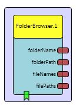

# FolderBrowser

Component Type: Sensor (Subcategory: File System)

The **FolderBrowser** component allows to browse and select files in a given folder or subfolders of it. The navigation can be controlled by events.

The FolderBrowser plugin block element of the ACS.

## Properties

- **initialFolder \[string\]**: The initial folder to start browsing.
- **wrapAround \[boolean\]**: If true, the browsing is wrapped around after the last entry.
- **exitInitialFolder \[boolean\]**: If true, the initial folder may be exited.
- **autoListFiles \[boolean\]**: Automatically output files when entering the folder.
- **noFolderMessage \[string\]**: Message to be sent to the folderName port if no subfolder is available.
- **noFileMessage \[string\]**: The message to be sent to the fileNames port, if no file is available.

## Event Listener Description

- **next**: Got to the next folder in current directory
- **previous**: Go to the previous folder in current directory
- **enter**: Enter current folder
- **exit**: Exit current folder
- **current**: Output current folder
- **listFiles**: Lists files in current folder

## Output Port Description

- **folderName \[string\]**: The name of the current folder (without path).
- **folderPath \[boolean\]**: The name of the current folder (including path)
- **fileNames \[boolean\]**: The names of the files in current folder.
- **filePaths \[boolean\]**: The names of the files in current folder (including path)
