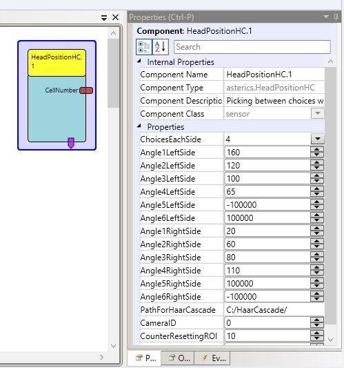

# HeadPositionHC

Component Type: Sensor (Subcategory:Computer Vision)

This plug-in provides a selection of up to 12 choices via the head. A choice can be selected through looking to the side. The angle of the head is calculated with the position of the ear and the mouth. The detection of the features is realised with HaarCascade.

The HeadPositionHC sensor plug-in

## Requirements

A webcam or an other camera has to be connected to the computer.

## Output Port Description

*   **CellNumber:** the number of the current selected Choice

## Event Triggerer Description

*   **Select:** will be triggered when the position is held for an amount of time

## Properties

*   **ChoiceEachSide \[integer\]:** sets the choices, which are visible and selectable for each side. (1-6 Choices each side are possible)
*   **Angle1LeftSide \[integer\]:** sets the upper value of the angle for the first choice on the left side. Every value lower than this value and higher than the value of Angle2LeftSide selects the first choice of the left side.
*   **Angle2LeftSide \[integer\]:** sets the upper value of the angle for the second choice on the left side. Every value lower than this value and higher than the value of Angle3LeftSide selects the second choice of the left side.
*   **Angle3LeftSide \[integer\]:** sets the upper value of the angle for the third choice on the left side. Every value lower than this value and higher than the value of Angle4LeftSide selects the third choice of the left side.
*   **Angle4LeftSide \[integer\]:** sets the upper value of the angle for the fourth choice on the left side. Every value lower than this value and higher than the value of Angle5LeftSide selects the fourth choice of the left side.
*   **Angle5LeftSide \[integer\]:** sets the upper value of the angle for the fifth choice on the left side. Every value lower than this value and higher than the value of Angle6LeftSide selects the fifth choice of the left side.
*   **Angle6LeftSide \[integer\]:** sets the upper value of the angle for the sixth choice on the left side. Every value lower than this value selects the sixth choice of the left side.
*   **Angle1RightSide \[integer\]:** sets the lower value of the angle for the first choice on the right side. Every value higher than this value and lower than the value of Angle2RightSide selects the first choice of the right side.
*   **Angle2RightSide \[integer\]:** sets the lower value of the angle for the second choice on the right side. Every value higher than this value and lower than the value of Angle3RightSide selects the first choice of the right side.
*   **Angle3RightSide \[integer\]:** sets the lower value of the angle for the third choice on the right side. Every value higher than this value and lower than the value of Angle4RightSide selects the first choice of the right side.
*   **Angle4RightSide \[integer\]:** sets the lower value of the angle for the fourth choice on the right side. Every value higher than this value and lower than the value of Angle5RightSide selects the first choice of the right side.
*   **Angle5RightSide \[integer\]:** sets the lower value of the angle for the fifth choice on the right side. Every value higher than this value and lower than the value of Angle6RightSide selects the first choice of the right side.
*   **Angle6RightSide \[integer\]:** sets the lower value of the angle for the sixth choice on the right side. Every value higher than this value selects the first choice of the right side.
*   **PathForHaarCascade \[string\]:** Filepath to the folder, where the HaarCascade-files are stored.
*   **CameraID \[integer\]:** the ID of the Camera.
*   **CounterResettingROI \[integer\]:** the number of frames to wait before resetting the ROI (finding the face) when no feature is found.
*   **CounterToSendSelectEvent \[integer\]:** the number of frames, which the person has to hold the position until the select event is triggered.