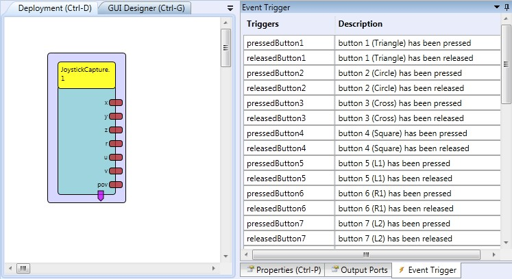
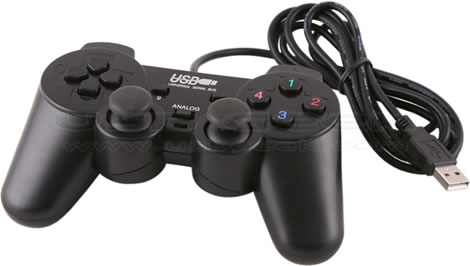

# Joystick Capture

Component Type: Sensor (Subcategory: Standard Input Devices)

The JoystickCapture component provides data from the first detected Joystick controller which is available on the local system. Six Joystick analog positions (axis), the Point-Of-View angle and up to 20 Buttons are available as output ports and event triggers.

JoystickCapture plugin

## Requirements

A joystick has to be connected and available to the operating system.

PC compatible GamePad

## Output Port Description

*   **x \[integer\]:** The X-Position of the Joystick.
*   **y \[integer\]:** The Y-Position of the Joystick.
*   **z \[integer\]:** The Z-Position of the Joystick.
*   **r \[integer\]:** The R-Position of the Joystick.
*   **u \[integer\]:** The U-Position of the Joystick.
*   **v \[integer\]:** The V-Position of the Joystick.
*   **pov \[integer\]:** The POV-angle of the Joystick.

## Event Trigger Description

*   **pressedButton1 - pressedButton20:** This event is fired if the corresponding button of the Joystick has been pressed.
*   **releasedButton1 - releasedButton20:** This event is fired if the corresponding button of the Joystick has been released.

## Properties

*   **updatePeriod \[integer\]:** This property value sets the update time for refreshing the joystick information (in milliseconds).