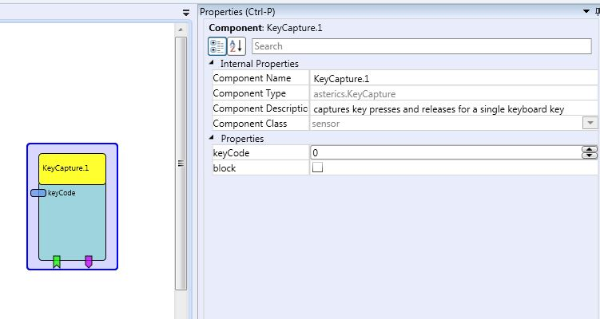

# {{$frontmatter.title}}

Component Type: Sensor (Subcategory: Standard Input Devices)

This component provides access to keystrokes of a single key on the keyboard. The keystroke capture does not depend on a particular window or text field to have the input focus. For every keypress and release of the specified key an event gets fired. Possible applications include triggering functions by keyboard input, interfacing to speech recognition software or remapping keys to other keycodes.

KeybCapture plugin

## Requirements

A keyboard which generates keystrokes or a software component which injects keystrokes into the operating system message queue.

## Mapping of keyCodes to actual keys

Key

KeyCode

A

30

B

48

C

46

D

32

E

18

F

33

G

34

H

35

I

23

J

36

K

37

L

38

M

50

N

49

O

24

P

25

Q

16

R

19

S

31

T

20

U

22

V

47

W

17

X

45

Y

21

Z

44

0

11

1

2

2

3

3

4

4

5

5

6

6

7

7

8

8

9

9

10

F1

59

F2

60

F3

61

F4

62

F5

63

F6

64

F7

65

F8

66

F9

67

F10

68

F11

87

F12

88

F13

91

F14

92

F15

93

F16

99

F17

100

F18

101

F19

102

F20

103

F21

104

F22

105

F23

106

F24

107

ESC

1

\-

12

\=/+

13

Backspace

14

Tab

15

Caps Lock

58

Cursor Up

57416

Cursor Left

57419

Cursor Right

57421

Cursor Down

57424

NumPad 0

82

NumPad 1

79

NumPad 2

80

NumPad 3

81

NumPad 4

75

NumPad 5

76

NumPad 6

77

NumPad 7

71

NumPad 8

72

NumPad 9

73

Ctrl left

29

Ctrl right

3613

Alt left

56

Alt right

3640

Context Menu

3677

Windows Key

3675 or 3676

SPACE

57

Print Screen

3639

Scroll Lock

70

Pause

3653

Enter

28

Page Up

3657

Page Down

3665

,

51

.

52

[Click here][1] to view a full list of keycodes.

## Input Port Description

*   **keyCode \[integer\]:** The keycode of the key which should be captured. For a list of the mapping between keycodes and keys see the graphics above.

## Event Trigger Description

*   **keyPressed:** This event port fires an event if the key with the specified keyCode was pressed.
*   **keyReleased:** This event port fires an event if the key with the specified keyCode was released.

## Event Listener Description

*   **enable:** The keystate is captured and events get fired
*   **disable:** The plugin does not fire any event.
*   **block:** After this event, the keystroke of the key with the specified keyCode is not forwarded to the operating system.
*   **unblock:** After this event, the keystroke of the key with the specified keyCode is forwarded to the operating system.

## Properties

*   **block \[boolean\]:** If this property is set to true, no key press activities will be routed to the operating system
*   **keyCode\[integer\]:** The keycode of the key which should be captured. For a list of the mapping between keycodes and keys see the graphics above.

[1]: https://github.com/kwhat/jnativehook/blob/master/src/java/org/jnativehook/keyboard/NativeKeyEvent.java "Opens external link in new window"
