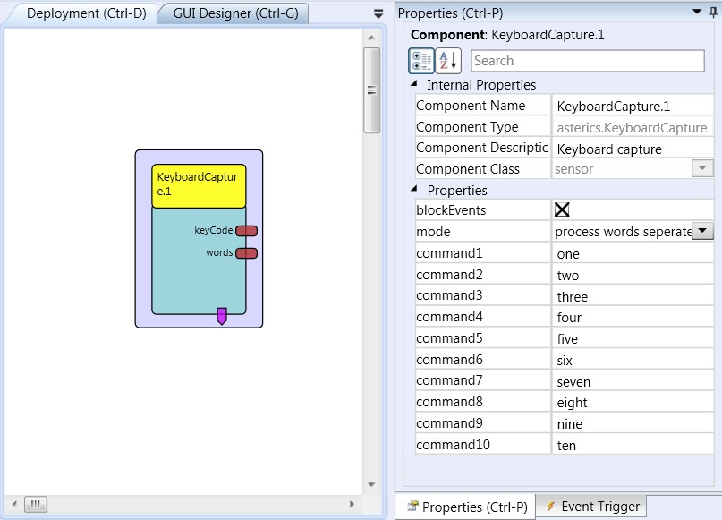

# Keyboard Capture

Component Type: Sensor (Subcategory: Standard Input Devices)

This component provides access to keystrokes input via a standard keyboard. The keystroke capture does not depend on a particular window or text field to have the input focus. The keycodes of the pressed keys and accumulated words (multiple keys separated by ) are provided at the output ports of this component. Possible applications include triggering functions by keyboard input, interfacing to speech recognition software or remapping keys to other keycodes.

KeyboardCapture plugin

## Requirements

A keyboard which generates keystrokes or a software component which injects keystrokes into the operating system message queue.

## Output Port Description

*   **keyCode \[integer\]:** This port sends the virtual keycode of the last pressed key as an integer value.
*   **words \[string\]:** This ports accumulates keystrokes and sends them as a string as soon as a blank separator (space key) appears in the key input stream.

## Event Trigger Description

*   **recognizedCommand1 - recognizedCommand10:** These event ports fire an event if one of seven command strings has been detected in the current input stream of keys.

## Properties

*   **blockEvents \[boolean\]:** If this property is set to true, no key press activities will be routed to the operating system - they will not be processed by other applications and disappear. If the property value is set to false, keystrokes will be passed back to the operating system and processed as usual.
*   **command1 \[string\] - command10 \[string\]:** Seven string properties to specify command strings. The component looks for these command strings in the input stream of keystrokes. If a command string matches, the corresponding event trigger port is raised. This can be useful for example to define voice commands which should trigger certain actions in other ARE plugins.