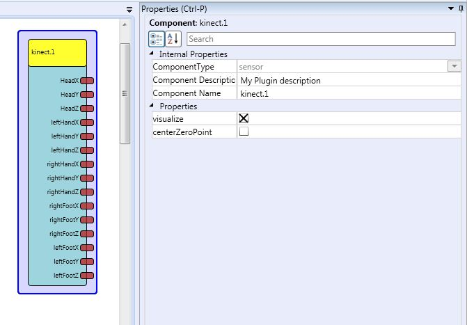

# Kinect

Component Type: Sensor (Subcategory: Standard Input Devices)

The Kinect component interfaces to the Microsoft Kinect camera over the OpenNI library. It provides the skeleton Data of exactly one person in front of the kinect camera.

For the installation of the OpenNI framework and the drivers see for example [here][1].

Kinect plugin

## Requirements

*   A Microsoft Kinect must be connected to the system.
*   The installed drivers must be compatible to the framework. e.g. The SensorKinect drivers work perfectly.
*   The OpenNI Framework must be installed.
*   The Nite Middleware must be installed

## Output Port Description

The range of the coordinates is 0 - 640 for the x coordinates and 0 - 480 for the y coordinates if centerZeroPoint is set false and -320 - 320 for the x coordinate and -240 - 240 for the y coordinate when set to true.

*   **HeadX \[double\]:** The X position of the Head
*   **HeadY \[double\]:** The Y position of the Head
*   **HeadZ \[double\]:** The Z position of the Head
*   **leftHandX \[double\]:** The X position of the left Hand
*   **leftHandY \[double\]:** The Y position of the left Hand
*   **leftHandZ \[double\]:** The Z position of the left Hand
*   **rightHandX \[double\]:** The X position of the right Hand
*   **rightHandY \[double\]:** The Y position of the right Hand
*   **rightHandZ \[double\]:** The Z position of the right Hand
*   **rightFootX \[double\]:** The X position of the right Foot
*   **rightFootY \[double\]:** The Y position of the right Foot
*   **rightFootZ \[double\]:** The Z position of the right Foot
*   **leftFootX \[double\]:** The X position of the left Foot
*   **leftFootY \[double\]:** The Y position of the left Foot
*   **leftFootZ \[double\]:** The Z position of the left Foot

## Properties

*   **visualize \[boolean\]:** When set to true a windows is displayed which shows the tracked skeleton. While the window is simply grey, no skeleton has been found yet.
*   **centerZeroPoint \[boolean\]:** Specifies wether the 0,0 point is at the top left corner (centerZeroPoint=false) or in the middle of the frame (centerZeroPoint=true)

[1]: http://studentguru.gr/b/vangos/archive/2011/01/20/how-to-successfully-install-kinect-windows-openni-nite.aspx