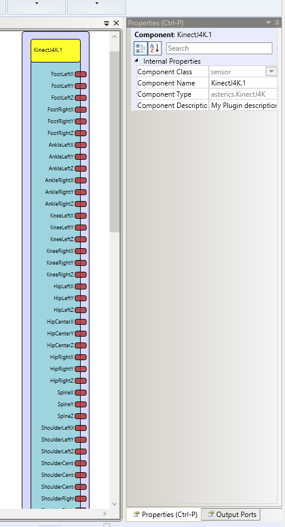

##

## KinectJ4K

# KinectJ4K

### Component Type: Sensor (Subcategory: Standard Input Devices)

The Kinect component interfaces to the Microsoft Kinect v1 camera over the [J4K library](http://research.dwi.ufl.edu/ufdw/j4k/J4KSDK.php). It provides the skeleton data of exactly one person in front of the kinect v1 camera.

For the installation the SDK from Microsoft is needed. The plugin was tested with the SDK-Version 1.5 (see [here](http://www.microsoft.com/en-us/download/details.aspx?id=29866)).

  
KinectJ4K plugin

## Requirements

- A Microsoft Kinect v1 must be connected to the system.
- The drivers from Microsoft (usually installed with the SDK) are required.

## Output Port Description

You can find more information about the Coordinate Spaces [here](http://www.microsoft.com/en-us/download/details.aspx?id=29866).

- **FootLeftX \[double\]:** The X position of the left Foot
- **FootLeftY \[double\]:** The Y position of the left Foot
- **FootLeftZ \[double\]:** The Z position of the left Foot
- **FootRightX \[double\]:** The X position of the right Foot
- **FootRightY \[double\]:** The Y position of the right Foot
- **FootRightZ \[double\]:** The Z position of the right Foot
- **AnkleLeftX \[double\]:** The X position of the left Ankle
- **AnkleLeftY \[double\]:** The Y position of the left Ankle
- **AnkleLeftZ \[double\]:** The Z position of the left Ankle
- **AnkleRightX \[double\]:** The X position of the right Ankle
- **AnkleRightY \[double\]:** The Y position of the right Ankle
- **AnkleRightZ \[double\]:** The Z position of the right Ankle
- **KneeLeftX \[double\]:** The X position of the left Knee
- **KneeLeftY \[double\]:** The Y position of the left Knee
- **KneeLeftZ \[double\]:** The Z position of the left Knee
- **KneeRightX \[double\]:** The X position of the right Knee
- **KneeRightY \[double\]:** The Y position of the right Knee
- **KneeRightZ \[double\]:** The Z position of the right Knee
- **HipLeftX \[double\]:** The X position of the left side of the Hip
- **HipLeftY \[double\]:** The Y position of the left side of the Hip
- **HipLeftZ \[double\]:** The Z position of the left side of the Hip
- **HipCenterX \[double\]:** The X position of the center of the Hip
- **HipCenterY \[double\]:** The Y position of the center of the Hip
- **HipCenterZ \[double\]:** The Z position of the center of the Hip
- **HipRightX \[double\]:** The X position of the right side of the Hip
- **HipRightY \[double\]:** The Y position of the right side of the Hip
- **HipRightZ \[double\]:** The Z position of the right side of the Hip
- **SpineX \[double\]:** The X position of the Spine
- **SpineY \[double\]:** The Y position of the Spine
- **SpineZ \[double\]:** The Z position of the Spine
- **ShoulderLeftX \[double\]:** The X position of the left Shoulder
- **ShoulderLeftY \[double\]:** The Y position of the left Shoulder
- **ShoulderLeftZ \[double\]:** The Z position of the left Shoulder
- **ShoulderCenterX \[double\]:** The X position of the area between the Shoulders
- **ShoulderCenterY \[double\]:** The Y position of the area between the Shoulders
- **ShoulderCenterZ \[double\]:** The Z position of the area between the Shoulders
- **ShoulderRightX \[double\]:** The X position of the right Shoulder
- **ShoulderRightY \[double\]:** The Y position of the right Shoulder
- **ShoulderRightZ \[double\]:** The Z position of the right Shoulder
- **ElbowLeftX \[double\]:** The X position of the left Elbow
- **ElbowLeftY \[double\]:** The Y position of the left Elbow
- **ElbowLeftZ \[double\]:** The Z position of the left Elbow
- **ElbowRightX \[double\]:** The X position of the right Elbow
- **ElbowRightY \[double\]:** The Y position of the right Elbow
- **ElbowRightZ \[double\]:** The Z position of the right Elbow
- **WristLeftX \[double\]:** The X position of the left Wrist
- **WristLeftY \[double\]:** The Y position of the left Wrist
- **WristLeftZ \[double\]:** The Z position of the left Wrist
- **WristRightX \[double\]:** The X position of the right Wrist
- **WristRightY \[double\]:** The Y position of the right Wrist
- **WristRightZ \[double\]:** The Z position of the right Wrist
- **HandLeftX \[double\]:** The X position of the left Hand
- **HandLeftY \[double\]:** The Y position of the left Hand
- **HandLeftZ \[double\]:** The Z position of the left Hand
- **HandRightX \[double\]:** The X position of the right Hand
- **HandRightY \[double\]:** The Y position of the right Hand
- **HandRightZ \[double\]:** The Z position of the right Hand
- **HeadX \[double\]:** The X position of the Head
- **HeadY \[double\]:** The Y position of the Head
- **HeadZ \[double\]:** The Z position of the Head
