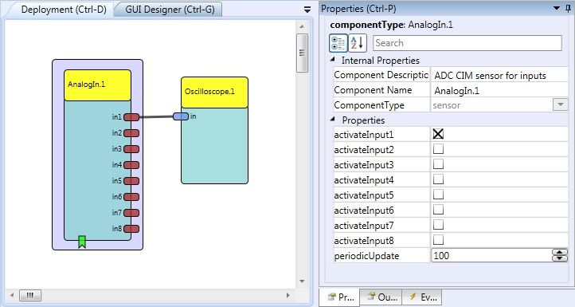
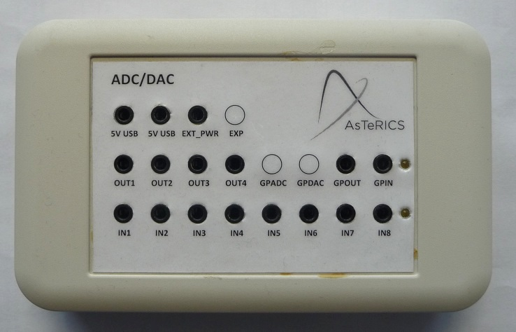

# Legacy Analog In

Component Type: Sensor (Subcategory: Generic Control Input)

The LegacyAnalogIn component is a sensor which is used in combination with the legacy ADC CIM (CIM Id: 0x0401). The component provides eight output ports which correlate to the inputs IN1 to IN8 of the CIM. The component can be set up to sample the inputs periodically or upon an incoming event.

Legacy AnalogIn plugin

## Requirements

This software component requires an ADC-DAC CIM (CIM ID: 0x0401) connected to a USB port.

Legacy ADC/DAC CIM

## Output Port Description

*   **in1 to in8 \[integer\]:** Each of these output port corresponds to one input of the ADC CIM. The measured values are forwarded directly from the CIM thus corresponding to the description given in the CIM specification.

## Event Listener Description

*   **adcSampleTrigger:** An incoming event on this port will cause the ADC CIM to sample data on its inputs. This event will only take effect if the periodic\_update property is set to 0.

## Properties

*   **periodicUpdate \[integer\]:** This property defines the time between data sampling requests to the ADC CIM (in milliseconds). The software component will send requests to the CIM in the given intervals. Due to current limitations of the ADC CIM it is recommended to use time intervals not lower than 50 milliseconds (20 samples per second).
*   **activateInput1 to activateInput8 \[Boolean\]:** These properties correspond the CIM's ADC inputs IN1 to IN8, if the property is true, the corresponding output port of the software component will send the sampled data.