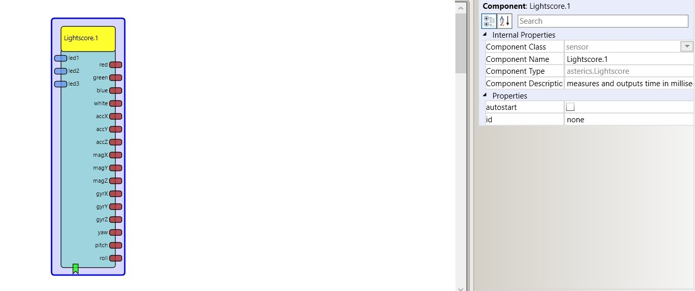

# Lightscore

Component Type: Sensor (Subcategory: Sensor Modules)

The Lightscore plugin provides the data output of the 9DOF IMU and RGB-color sensor [lightscores][1]. Additionally to the raw data, calculated euler values of the orentation (picht, yaw, roll) are provided. Please note that this in an early version of the product and the installation process is thus a bit demanding ...

Lightscore plugin

## Requirements

This plugin requires a lightscroes BLE sensor module connected to the AsTeRICS platform, please contact [AllesOderLicht][2] for cooperation or details about the hardware.

## Input Port Description

*   **led1 \[double\]:** light intensity for led1. \[currently not used\]
*   **led2 \[double\]:** light intensity for led2. \[currently not used\]
*   **led3 \[double\]:** light intensity for led3. \[currently not used\]

## Event Listener Description

*   **start:** start data transfer \[currently not used\]
*   **stop:** stop data transfer \[currently not used\]

## Output Port Description

*   **red \[double\]:** Red light intensity.
*   **green \[double\]:** Green light intensity.
*   **blue double\]:** Blue light intensity.
*   **white \[double\]:** White / total light intensity.
*   **accX \[double\]:** Acceleration X axis.
*   **accY \[double\]:** Acceleration Y axis.
*   **accZ \[double\]:** Acceleration Z axis.
*   **magX \[double\]:** Magnetometer X axis.
*   **magY \[double\]:** Magnetometer Y axis.
*   **magZ \[double\]:** Magnetometer Z axis.
*   **gyrX \[double\]:** Gyroscope X axis.
*   **gyrY \[double\]:** Gyroscope Y axis.
*   **gyrZ \[double\]:** Gyroscope Z axis.
*   **yaw \[double\]:** Yaw value in euler degrees.
*   **pitch \[double\]:** Pitch value in euler degrees.
*   **roll \[double\]:** Roll value in euler degrees.

## Properties

*   **autostart \[Boolean\]:** Start data transmission automatically after model start. \[currently not used\]
*   **id \[String\]:** ID number of the lichtscores sensor. \[currently not used\]

[1]: https://allesoderlicht.com/Archive/projects/lightscores
[2]: https://allesoderlicht.com/contact