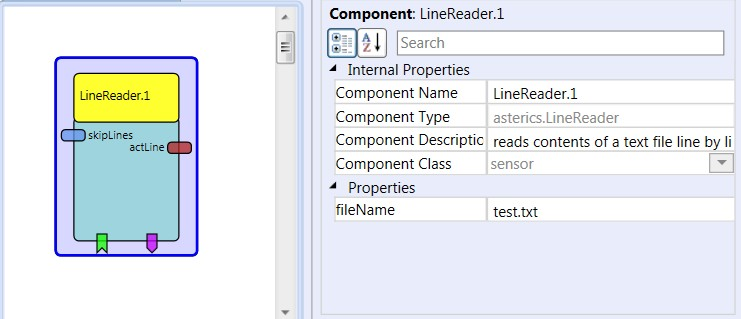

# LineReader

Component Type: Sensor (Subcategory: File System)

This component reads lines from a text file and sends them to an output port. The line reading can be triggered by an incoming event.

ButtonGrid plugin

## Input port Description

*   **skipLines (integer):** When an integer number is received at this port, the component tries to skip this number of lines. The next line will be read from the resulting position.

## Output port Description

*   **actLine (string):** A line of text which has been read from the file (as line termination character, the "enter"-key (\\n) is used.

## Event Listener Description

*   **readNextLine:** When this event is triggered, the component tries to read one line of text from the file and sends it to the output port.
*   **resetToFirstLine:** When this event is triggered, the internal file pointer is reset ot the beginning of the file.

## Event Trigger Description

*   **endOfFile:** This event is fired when no line can be read from the file (file end or other error occurred)

## Properties

*   **fileName \[string\]:** The full path and file name of the text file to read. The path can be given as absolute path or relative to the ARE executable's directory