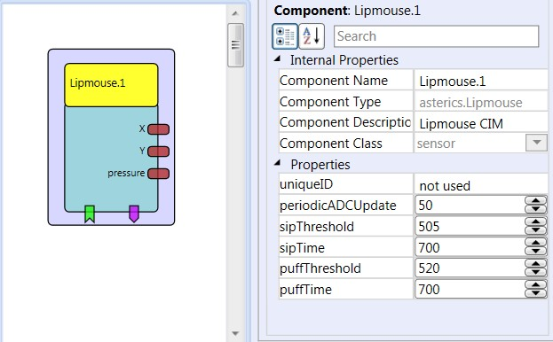
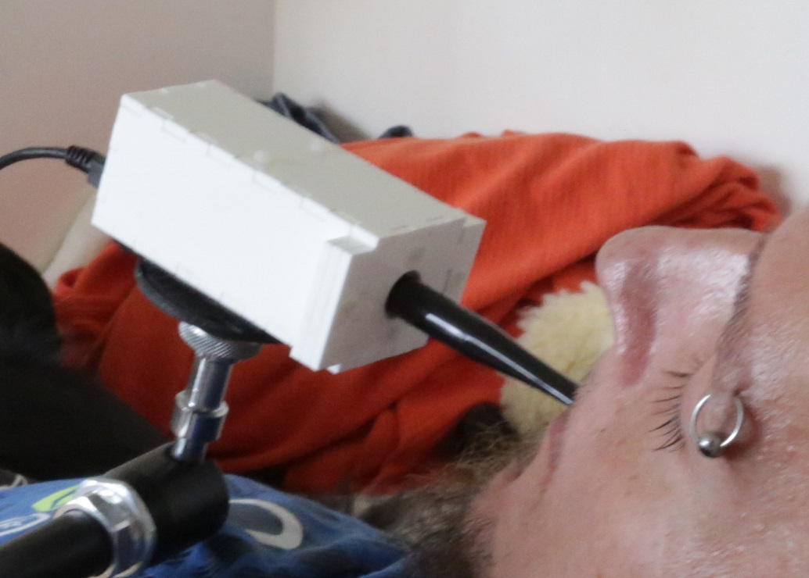

# Lipmouse

### Component Type: Sensor (Subcategory:Sensor Modules)

This component provides signals from the Lipmouse module, which allows computer control via a mouthpiece. The user can create input signals with 3 degrees of freedom by interacting with the mouthpiece: left/right, up/down and sip/puff. The horizontal and vertical movements are measured via force sensors inside the lipmouse module. The sip/puff actions are measured via a pressure sensor. The lipmouse can be adjusted to very low force that it can be used by persons with severly reduced motor capabilites (e.g. late stage musculuar dystrophy or quadraplegia up to C1/C2 lesions).

  
the Lipmouse sensor plugin

## Requirements

The Lipmouse module must be connected to a USB port. Firmware for the lipmouse sensor can be found in the folder CIMs/Lipmouse_CIM. A detailed design documentation will be provided in the future.

  
Lipmouse sensor application

## Output Port Description

- **X \[integer\]:** the force applied to the Lipmouse mouthpiece in x-direction
- **Y \[integer\]:** the force applied to the Lipmouse mouthpiece in y-direction
- **pressure \[integer\]:** the pressure value applied to the sip/puff - sensor

## Event Listener Description

- **calibration:** if this event is received, the x/y force value is set to 0 (removing any drift of the sensor values)

## Properties

- **periodicADCUpdate \[integer\]:** the update rate for force and pressure values in milliseconds.
