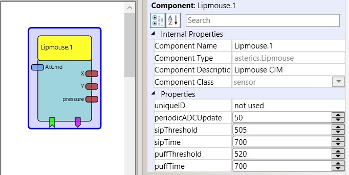
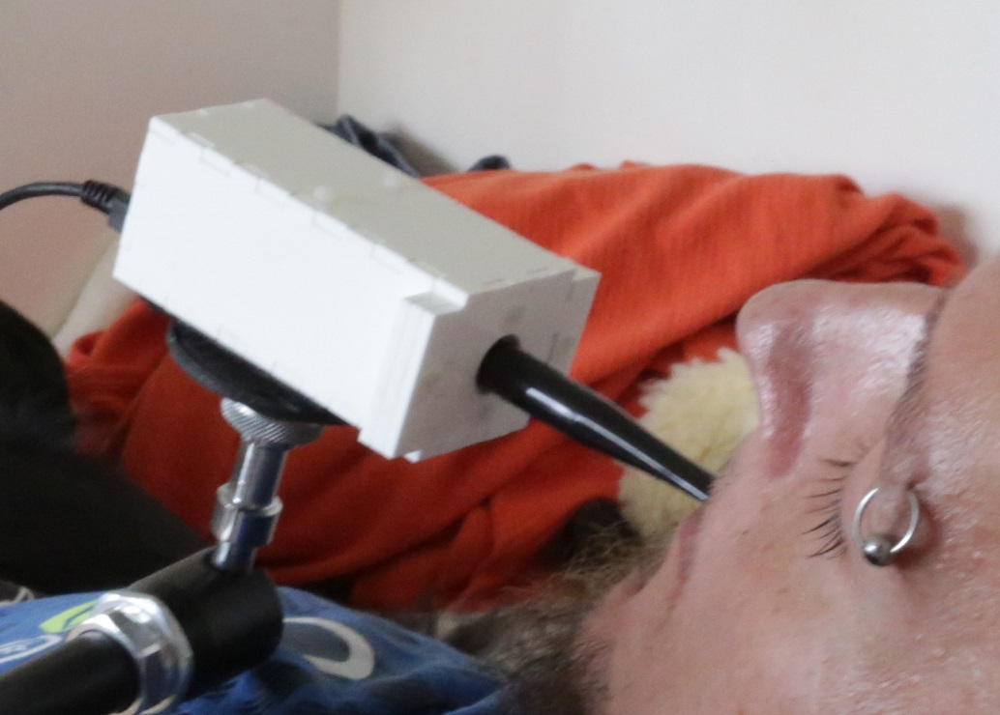

# Lipmouse

Component Type: Sensor (Subcategory:Sensor Modules)

This component provides signals from the Lipmouse module, which allows computer control via a mouthpiece. The user can create input signals with 3 degrees of freedom by interacting with the mouthpiece: left/right, up/down and sip/puff. The horizontal and vertical movements are measured via force sensors inside the lipmouse module. The sip/puff actions are measured via a pressure sensor. The lipmouse can be adjusted to very low force that it can be used by persons with severly reduced motor capabilites (e.g. late stage musculuar dystrophy or quadraplegia up to C1/C2 lesions).

The Lipmouse sensor plugin

## Requirements

The Lipmouse module must be connected to a USB port. Firmware for the lipmouse sensor can be found in the folder CIMs/Lipmouse\_CIM. The free "teensy loader" tool can be used to update the firmware of the lipmouse module. An alternative stand-alone firmware and configuration GUI is provided in the folder CIMs/StandAlone\_Modules\_FLipWare. Detailed design documentation will be provided in the future.

Lipmouse sensor application

## Output Port Description

*   **X \[integer\]:** the force applied to the Lipmouse mouthpiece in x-direction
*   **Y \[integer\]:** the force applied to the Lipmouse mouthpiece in y-direction
*   **pressure \[integer\]:** the pressure value applied to the sip/puff - sensor

## Event Listener Description

*   **calibration:** if this event is received, the x/y force value is set to 0 (removing any drift of the sensor values)
*   **setLed1:** if this event is received, Led1 will be turned on
*   **clearLed1:** if this event is received, Led1 will be turned off
*   **setLed2:** if this event is received, Led2 will be turned on
*   **clearLed2:** if this event is received, Led2 will be turned off
*   **setLed3:** if this event is received, Led3 will be turned on
*   **clearLed3:** if this event is received, Led3 will be turned off

## Event Triggerer Description

*   **sip:** will be triggered when pressure decreases under the selected sip treshold and increses back before the selected sipTime has passed
*   **longSip:** will be triggered when pressure decreases under the selected sip treshold and increases back after the selected sipTime has passed
*   **sipStart:** will be triggered at the moment when pressure decreases under the selected sip treshold
*   **sipEnd:** will be triggered at the moment when pressure increases above the selected sip treshold
*   **puff:** will be triggered when pressure increases above the selected puff treshold and decreases back before the selected puffTime has passed
*   **longPuff:** will be triggered when pressure increases above the selected puff treshold and decreases back after the selected puffTime has passed
*   **puffStart:** will be triggered at the moment when pressure increases above the selected puff treshold
*   **puffEnd:** will be triggered at the moment when pressure decreases under the selected puff treshold
*   **button1Pressed:** will be triggered when button1 of the lipmouse is pressed
*   **button1Released:** will be triggered when button1 of the lipmouse is released
*   **button2Pressed:** will be triggered when button2 of the lipmouse is pressed
*   **button2Released:** will be triggered when button2 of the lipmouse is released
*   **button3Pressed:** will be triggered when button3 of the lipmouse is pressed
*   **button3Released:** will be triggered when button3 of the lipmouse is released

## Properties

*   **uniqueID \[integer\]:** a unique identifier, useful if more then one lipmouse modules are used (dynamic property).
*   **periodicADCUpdate \[integer\]:** the update rate for force and pressure values in milliseconds.
*   **sipThreshold \[integer\]:** threshold value for sip actions.
*   **sipTime \[integer\]:** threshold time for sip/longSip events.
*   **puffThreshold \[integer\]:** threshold value for puff actions.
*   **puffTime \[integer\]:** threshold time for puff/longPuff events.