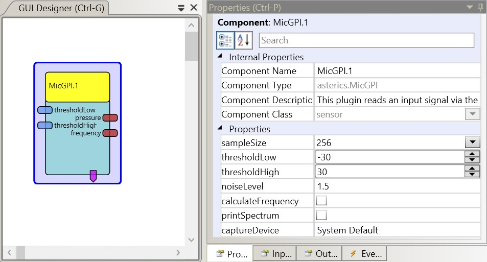

##

## MicGPI

# MicGPI

### Component Type: Sensor (Subcategory: Generic Control Input)

This component reads the input from the microphone or line-in of a computer's sound device. The averaged amplitude / sound pressure level and the dominant frequency can be calculated and used for control purposes. It is highly recommended to use a headset microphone to avoid unwanted detections from ambient noise. The sampling rate can be set (300-44100 Hz), the other device properties are mono (1 channel) and 8 bit resoltion.

It is possible to attach a momentary switch via standard 3.5mm jack plug to the mic/line input of the soundcard (or a cheap USB soundcard) and use this component for detection of switch presses.

**Disclaimer:** Attaching a switch to mic/line input does not work with all sound cards. Although we are not aware of a permanent damage to a sound card, you do this on your own risk !

## Requirements

A internal or external sound device with mic or line input is required. If the component is utilized as switch input, a momentary switch must be attached to the line-in or microphone input jack. No additional input circuit is required. Any sort of filtering of the signal like background noise cancelling must be disabled.

## Input Port Description

- **thresholdLow \[int\]:** This input port sets the low threshold below a signal must move that a inLow event gets triggered.
- **thresholdHigh \[int\]:** This input port sets the high threshold above a signal must move that a inHigh event gets triggered.

## Output Port Description

- **pressure \[double\]:** This port outputs the sound amplitude or pressure level of the mic input signal (the values depend on the selected calculation mode).
- **frequency \[integer\]:** In case frequency calculation is enabled, this port outputs the dominant frequency of the spectrum (in Hz).

## Event Trigger Description

- **inLow:** This event is fired if the calculated level goes below the low threshold (can be used to detect switch press/release or sound pressure level).
- **inHigh:** This event is fired if the calculated level goes above the high threshold (can be used to detect switch press/release or sound pressure level).

## Properties

- **samplingRate \[int\]:** Defines the sampling rate in Hz (allowed values are in the rang of 300 - 44100 Hz)
- **sampleSize \[int\]:** Defines the size of the sample buffer. Must be a power of 2. The values 32/64/128/256/512/1024/2048 can be selected from a combobox. This buffer size determines the calculation-interval on the output ports.
- **mode \[int, combobox selection\]:** Defines the way how the output signal (which is also compared to the threshold values) is calculated. The calculation is applied on a block of samples of the selected size. Available options are: average sample values, average absolute sample values, min value, max value and max absolute value
- **thresholdLow \[int\]:** This property sets the low threshold below a signal must move that a inLow event gets triggered.
- **thresholdHigh \[int\]:** This property sets the high threshold above a signal must move that a inHigh event gets triggered.
- **noiseLevel \[double\]:** This property defines a minimum level fo a valid sound signal. All noise which is below this level will be attenauted to avoid unwanted detections.
- **calculateFrequency \[boolean\]:** If true, an FFT will be performed to calculate the frequency spectrum and output the dominant frequency to the associated port.
- **printSpectrum \[boolean\]:** If this property is set to true and frequency calculation is enabled, the FFT spectrum will be printed to the console (only reasonable in debug mode).
- **captureDevice: \[string\]:** This property defines the sound card from which the audio samples should be analysed. (dynamic property, values are suggested when ARE is in synced state)
