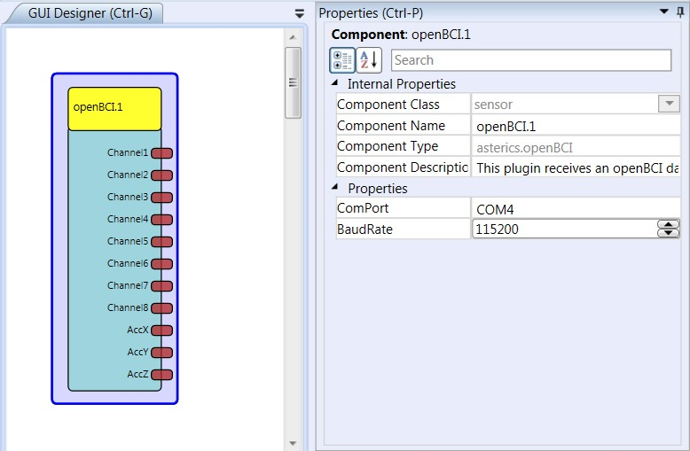

# OpenBCI

Component Type: Sensor (Subcategory: Bioelectric Measurement)

This component provides an interface to bioelectric amplifiers which are compatible to the openBCI packet fromat. For more information please refer to the [OpenBCI][1] website. The COM Port number where the device is connected must be specified in the plugin properties.

OpenBCI plugin

## Requirements

This software component requires an Open BCI compatible device connected to a COM Port, which sends packet protocol for channel data.

## Output Port Description

- **Channel1 to Channel8 \[integer\]:** Each output corresponds to the sampled data from its corresponding channel. A calibration procedure to obtain the factor for calculation of microvolts must be performed with the amplifier device.
- **AccX, AccY, AccZ \[integer\]:** The current values of the 3 axis of the acceleration sensor.

## Properties

- **COMPort \[String\]:** The name of the COM port, for example COM2 or COM17.
- **Baudrate \[Integer\]:** The baud rate for the transmission. Standard is 115200.

[1]: http://www.openbci.com/
