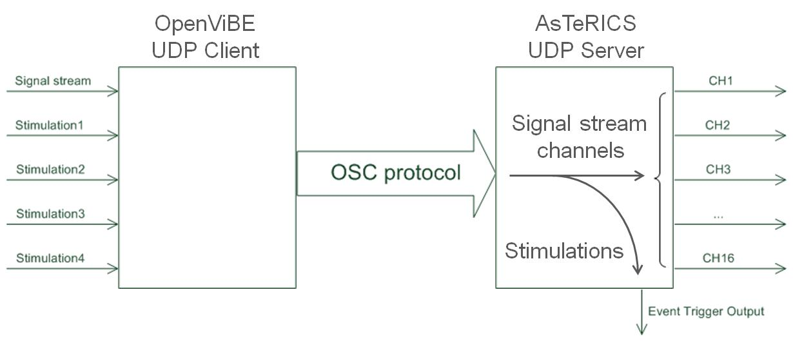
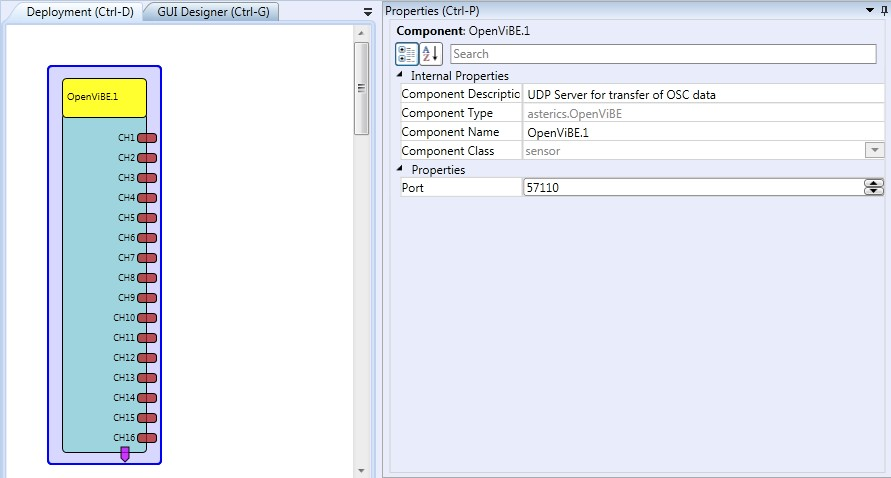

# OpenVibe

Component Type: Sensor (Subcategory: Bioelectric Measurement)

The OpenVibe plugin allows obtaining data from a connection to the OpenVibe BCI software which is currently one of the most prominent BCI frameworks. OpenVibe supports a wide range of biosignal and EEG acquisition devices and provides sophisticated signal processor training and classification algorithms. The graphical design concept is similar to the ACS, and plugins can be committed by the open source community.  
To send data from OpenVibe to the ARE plugin, a dedicated OpenVibe Plugin called �AsTeRICS connection� has been created. This OpenVibe plugin sends up to 16 channels of signal data and up to 61 different stimulation events to the ARE plugin via a UDP connection, by using the Open Sound Control (OSC) protocol. The following figure shows this communication flow.

Data flow from OpenVibe to AsTeRICS

## Requirements

The OpenVibe framework has to be installed and the AsTeRICS connection plugin must be available (this means that OpenVibe has to be built from sources and the AsTeRICS connection plugin is included in the build process). Furthermore, the correct UDP port must be set in the properties of both plugins, and the ARE plugin has to be running when OpenVibe is started (because the ARE plugin acts as server and opens a listening port).

OpenVibe plugin

## Output Port Description

- **CH1 - CH16 \[double\]:**these are the output ports for the OpenVibe signals. Up to 16 signals can be sent

## Event Trigger Description

- **OVTK_StimulationId_Label_00 - 0C**
  \*\*\* OVTK_StimulationId_Letter_0 - Z
- OVTK_StimulationId_Label_Target
- OVTK_StimulationId_Label_NonTarget\*\*

These are the Event triggers which can be linked to the corresponding OpenVibe Stimulation IDs. In total, 56 different stimulations can be processed.

## Properties

- **Port \[integer\]:** the UPD port which is opened by the AsTeRICS plugin to wait for the OpenVibe connection
