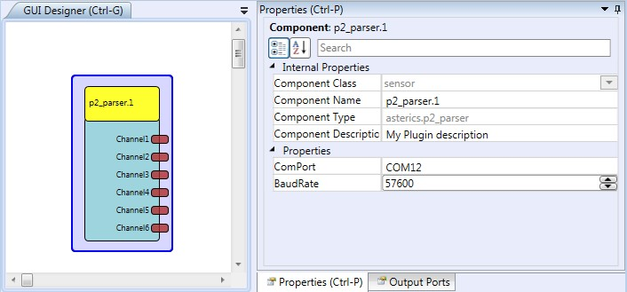

  
---
P2 Parser
---

# P2Parser

### Component Type: Sensor (Subcategory: Bioelectric Measurement)

This component provides an interface to bioelectric amplifiers which are compatible to the openEEG P2 packet fromat (e.g. the ModualarEEG or the SMTEEG by Olimex). For more information please refer to the [OpenEEG](http://openeeg.sf.net) website.The COM Port number where the device is connected must be specified in the plugin properties.

  
OpenEEG P2 Parser plugin

## Requirements

This software component requires an OpenEEG compatible device connected to a COM Port, which sends the P2 packet protocol for channel data.

## Output Port Description

*   **Channel1 to Channel6 \[integer\]:** Each output corresponds to the sampled data from its corresponding channel. The values range for -512 to 512. A calibration procedure to obtain the factor for calculation of microvolts must be performed with the amplifier device.

## Properties

*   **COMPort \[String\]:** The name of the COM port, for example COM2 or COM17.
*   **Baudrate \[Integer\]:** The baud rate for the transmission. Standard is 57600.