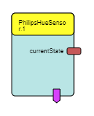

# PhilipsHueSensor

Component Type: Sensor (Subcategory: Home Control)

The PhilipsHueSensor component provides an interface to the motion sensor and dimmer switch of the 
[Philips Hue smart lighting system](https://www2.meethue.com/en-us). 

One instance of this plugin can fire events for one specified Philips Hue sensor.

Philips Hue sensor plugin

## Requirements

* A Philips Hue hardware Bridge
* A Philips Hue Sensor (a dimmer switch or a motion sensor)

## Initial Setup

See the PhilipsHue actuator plugin documentation for detailed instructions.

## Output Port Description

*   **currentState \[string\]:** This port periodically returns the state the target sensor. The polling rate can be set via the updateRate property (in milliseconds).

## Event Trigger Description

* **statusChanged:** fires when the configure sensor changes its status (buttons pressed, motion detected, battery charge, etc.)
* **tick:** fires for each tick (depends on updateRate property)
* **motionDetected:** fires once presence is detected (motion sensor only)
* **dimmerButtonOn:** fires if the first button is pressed (dimmer switch only)
* **dimmerButtonBrighter:** fires if the second button is pressed (dimmer switch only)
* **dimmerButtonDarker:** fires if the third button is pressed (dimmer switch only)
* **dimmerButtonOff:** fires if the last button is pressed (dimmer switch only)

## Properties

* **apiKey \[string\]:** API key for the REST API of the bridge
* **ip \[string\]:** IP address of the bridge
* **target \[string\]:** sensor that should be used as input in the form `/sensors/<id>`
* **updateRate \[integer\]:** polling rate for **currentState** and the event triggers
    * value in milliseconds
    * the lower this value is, the faster you will be notified of changes
    * don't set this too low or the bridge might slow down (500 milliseconds is a good compromise)