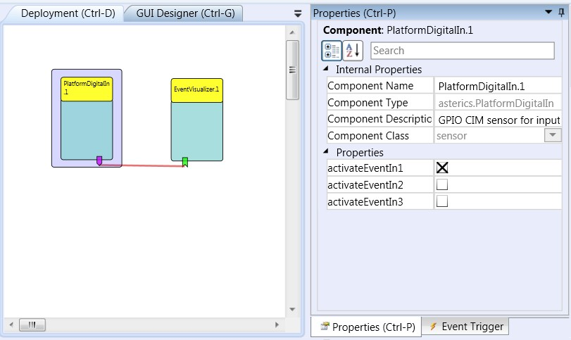

# Platform Digital In

Component Type: Sensor (Subcategory: Personal Platform)

The PlatformDigitalIn component provides an interface to read the digital inputs of the AsTeRICS Personal Platform. On state changes of the connected signals (transitions to high or low level), the component generates corresponding trigger events.

PlatformDigitalIn plugin

## Requirements

This component requires the Core CIM (CIM Id: 0x0602) of the AsTeRICS Personal Platform.

")

The AsteRICS Personal Platform

## Event Trigger Description

*   **in1High to in3High:** Each of these event ports is linked to one input port, if the device connection to this input port delivers a signal which changes to high level, an event will be raised on the corresponding port.
*   **in1Low to in3Low:** Each of these event ports is linked to one input port, if the device connection to this input port delivers a signal which changes to low level, an event will be raised on the corresponding port.

## Properties

*   **activateEventIn1 to activateEventIn3 \[Boolean\]:** These properties declare for each port whether or not a signal transition on the actual input port should result in an event being triggered in the ARE. If a property is set true for one input, it will raise events on signal transitions, if it is set to false it will not.