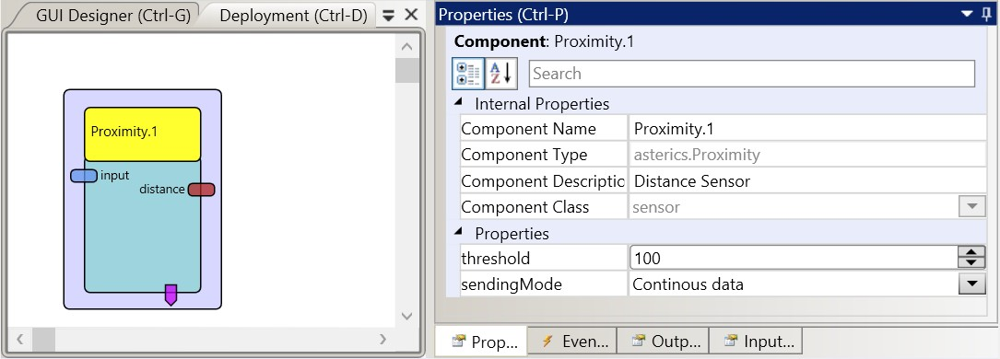
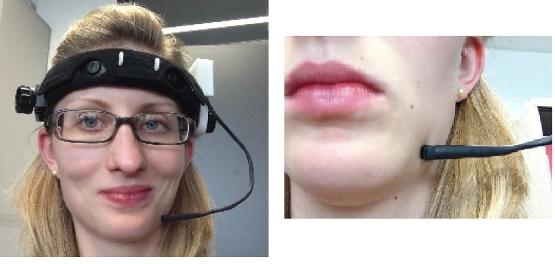

# Proximity

Component Type: Sensor (Subcategory:Sensor Modules)

This component provides the distance sensor signal from the Proximity sensor board, which has been developed in course of the Bachelor Theses of Franziska Horak at the UAS Technikum Wien. The Proximity sensor board can be head mounted and offers an alternative input method via minimal movements of facial features - e.g. chin movements. In several proof-of-concept models, on-screen keyboard control and mouse control could be shown. For detailed information please refer to the file Documentation/DIYGuides/ProximitySensor\_Horak.pdf

The Proximity sensor plugin

## Requirements

The Proximity sensor has to be connected to a USB port. Design files and firmware for the proximity sensor can be found in the folder CIMs/Proximity\_CIM.

Proximity sensor application

## Input Port Description

*   **input \[integer\]:** this input port allows setting the threshold value for the creation of events

## Output Port Description

*   **distance \[integer\]:** the currently measured distance from sensor to subject

## Event Trigger Description

*   **LowToHigh:** this event is triggered when the distance increases above the threshold value
*   **HighToLow:** this event is triggered when the distance decreases below the threshold value

## Properties

*   **threshold \[integer\]:** the threshold value for creating events.
*   **sendingMode \[combobox selection\]:** if "Continuous data" is selected, the distance values are sent to the output port, if "Events: below->above", "Events: above->below" or "Events: both" are selected, the respective event triggers will be generated.