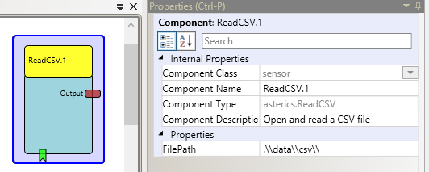

# {{$frontmatter.title}}

Component Type: Sensor (Subcategory: File System)

This plugin reads a whole .csv file and sends the seperate lines as strings to the output port.

ReadCSV

## Event Listener Description

- **read:** Opens a file-chooser menu to select a csv-file which should be opened and read. The file is read immideately after selection (attention: this blocks the ARE model execution until the file contents are read completely !)

## Output port Description

- **Output\[string\]:** The port sends the individual lines of the file as strings. An example for the string is: "data1;data2;data3". To seperate the string into individual strin values, the StringSplitter can be used.

## Properties

- **FilePath\[string\]:** Defines the default Path were the file is located. (TBD: add property for default FileName and line-by-line read option)
