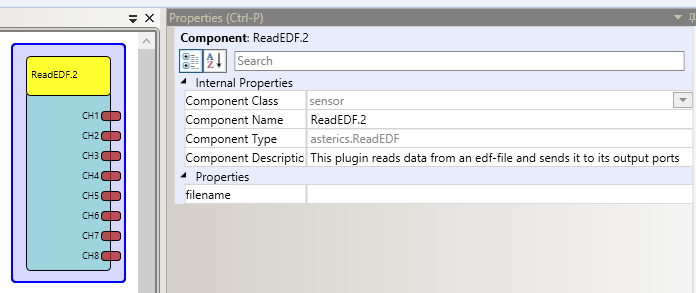

# {{$frontmatter.title}}

Component Type: Sensor (Subcategory: File System)

This plugin reads an .edf file and sends the data to its output ports

ReadEDF

## Output port Description

- **CH1 - CH8\[double\]:** these ports send the samples of the recorded signals.

## Properties

- **FileName\[string\]:** specifies the name of the file, in which the data has been recorded **Supports value suggestions from ARE (dynamic property)**
