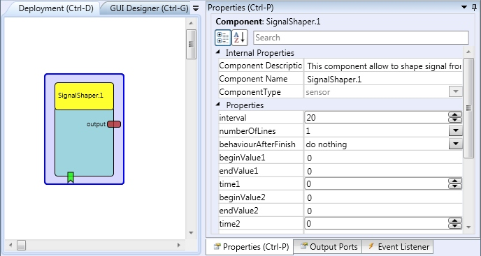
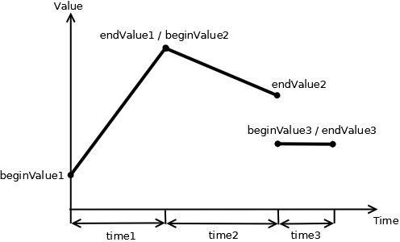

# Signal Shaper

Component Type: Sensor (Subcategory: Simulation)

The SignalShaper component can be used to generate signal composed from basic linear functions.

SignalShaper plugin

Example composed signal created from three linear signals

## Output Port Description

*   **output \[double\]:** The output port for the signal.

## Event Listener Description

*   **start:** Start the signal generation. If this event is received during signal generation, the signal generation is restarted.  
    

## Properties

*   **interval \[integer\]:** The sampling  rate in milliseconds.  
    
*   **numberOfLines \[integer\]:** The number of linear signals used to shape the output signal.  
    
*   **behaviourAfterFinish \[****integer****\]:** Defines the component behaviour after all signal lines have been sent:  
    *   **do nothing:** stop any action.  
        
    *   **repeat:** Send the signal lines from beginning.  
        
    *   **send the last value:** Continue to send the last value of the signal.  
        
*   **beginValue1...beginValue5 \[double\]:** The begin value of the linear signals.
*   **endValue1...endValue5 \[double\]:** The end value of the linear signals.
*   **time1...time5 \[integer\]:** The duration of the linear signals in milliseconds.