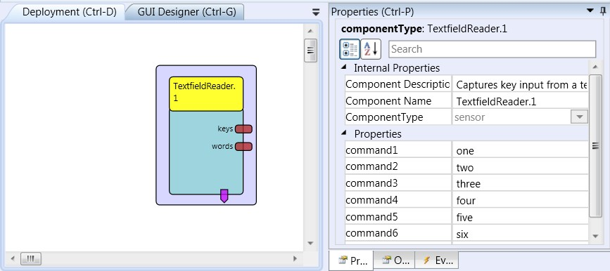

# Textfield Reader

Component Type: Sensor (Subcategory: Graphical User Interface)

Similar to the Keyboard Hook component, this component provides access to keystrokes coming from a standard keyboard or injected via software. The difference to the Keyboard Hook is that the Text Field Reader opens a GUI element with a text input filed and processes key input only from this text field. The keycodes of the pressed keys and accumulated words (multiple keys separated by ) are provided at the output ports of this component. Possible applications include triggering functions by keyboard input or remapping keys to other keycodes.

TextfieldReader plugin

## Requirements

A keyboard which generates keystrokes or a software component which injects keystrokes into the operating system?s message queue.

## Output Port Description

*   **keys \[integer\]:** This port sends the virtual keycode of the last pressed key as an integer value.
*   **words \[string\]:** This ports accumulates keystrokes and sends them as a string as soon as a blank separator (space key) appears in the key input stream.

## Event Trigger Description

*   **recognizedCommand1 - recognizedCommand7:** These event ports fire an event if one of seven command strings has been detected in the current input stream of keys.

## Properties

*   **command1 \[string\] - command7 \[string\]:** Seven string properties to specify command strings. The component looks for these command strings in the input stream of keystrokes. If a command string matches, the corresponding event trigger port is raised. This can be useful for example to define voice commands which should trigger certain actions in other ARE plugins.
*   **displayGUI \[boolean\]:** If selected, the GUI of this component will be displayed - if not, the GUI will be hidden and disabled.