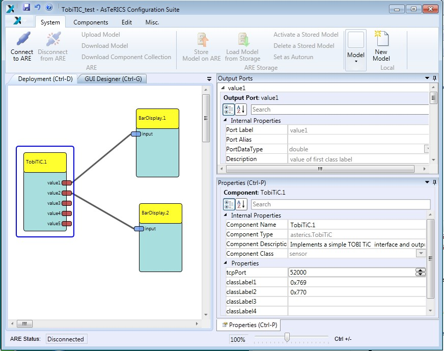
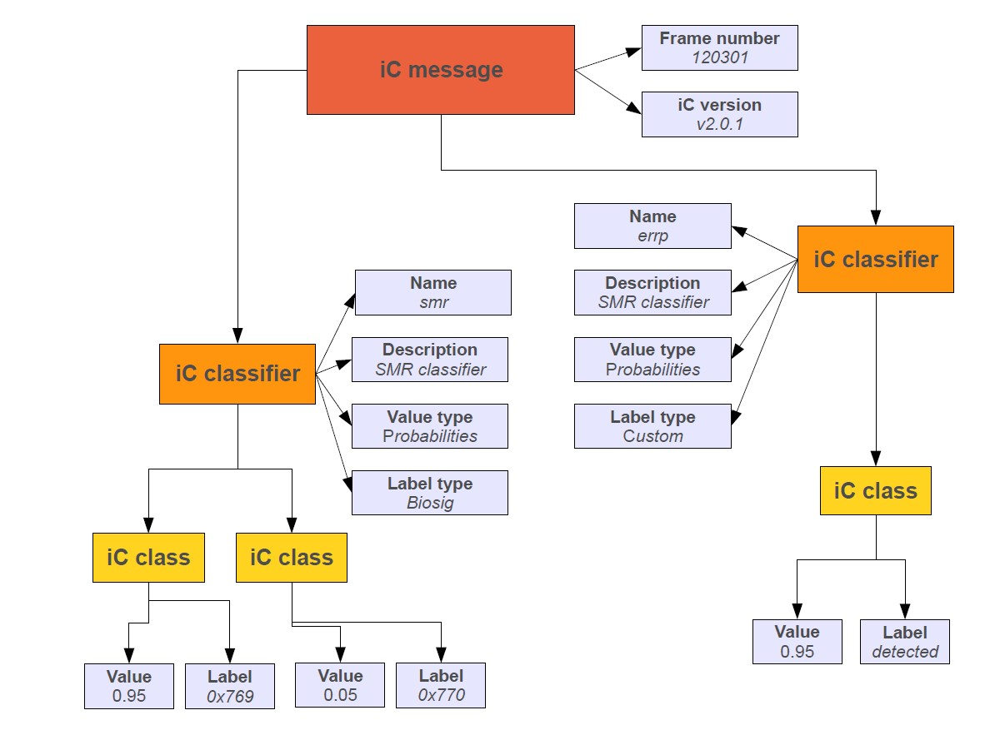
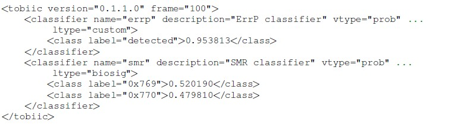

# Tobi TiC

### Component Type: Sensor (Subcategory: Bioelectric Measurement)

The Tobi TiC plugin allows obtaining data from a connection to the [Tobi Framework](http://www.tobi-project.org) (Tools for Brain Computer Interaction). Tobi defined standard for BCI interfaces, e.g. beteween classification and actuator modues. Tobi supports a wide range of biosignal and EEG acquisition devices. The TiC interface is dedicated to transfer classifier results to actuators. This plugin implements a simple TiC reader via a TCP socket. Up to 5 TOBI class labels can be defined which will be used to extract values from incoming TiC-compatible xml messages. These class labels and the sever socket which is openend by the plugin can be defined viy plugin properties.

  
Tobi TiC plugin

## Requirements

TiC-compatible messages must be sent to the server port which is opened by the plugin.

  
Internal structure of a TOBI iC message

### Example iC message:

  
example TOBI iC message

## Output Port Description

- **value1 � value5 \[double\]:**these are the output ports for the Tobi class values. Up to 5 signals can be sent

## Properties

- **tcpPort \[integer\]:** the TCP port which is opened by the AsTeRICS plugin to wait for the Tobi connection
- **classLabel1 - classLabel5 \[string\]:** the classLabels to extract values from the Tobi TiC messages. Values will be directed to the corresponding output ports of the plugin.
