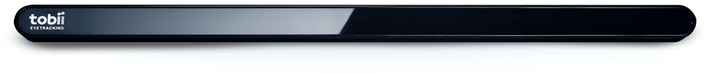

# Tobii4CHeadTracker

Component Type: Sensor (Subcategory: Computer Vision)

OS: Windows

This component provides access to the raw head tracking data of the [Tobii Tracker 4C][1] eye tracking device. The data includes the head position (x/y/z) in mm and the head rotation (x/y/z) in Euler angles. The Tobii4CHeadTracker plugin can be combined with the [EyeX][2] plugin to also get the eye gaze data.

The plugin connects to the device via the [Tobii Eye Tracking Core Software][3].

## Requirements

- OS: Windows
- USB port: The Tracker 4C needs at least a USB 2.0 port. Preferably don't use a USB hub, or only use a [recommended hub from Tobii][4].
- [Tobii Eye Tracking Core Software][5] must be installed and running.

Tobii Tracker 4C

## Output Port Description

- **headRotX \[double\]:**Head rotation x angle (Euler).
- **headRotY \[double\]:**Head rotation y angle (Euler).
- **headRotZ \[double\]:**Head rotation z angle (Euler).
- **headPosX \[double\]:**Head position x coordinate (mm).
- **headPosY \[double\]:**Head position y coordinate (mm).
- **headPosZ \[double\]:**Head position y coordinate (mm).

## Event Listener Description

- **activate:** Activates (Turns on) the eye tracker device.
- **deactivate** Deactivates (Pauses) the eye tracker device.

## Event Trigger Description

- **userPresenceStatusAway:** Indicates that no user is sitting in front of the tracker.
- **userPresenceStatusPresent:** Indicates that a user is sitting in front of the tracker.
- **calibrationStarted:** Indicates that the tracker calibration has been started.
- **calibrationFinished:** Indicates that the tracker calibration has been finished.
- **displayAreaChanged:** Indicates that the assigned display has been changed.
- **powerSaveStateTrue:** Indicates that the tracker is in power save mode.
- **powerSaveStateFalse:** Indicates that the tracker is not in power save mode.
- **deviceOff:** Indicates that the tracker is currently paused.
- **deviceOn:** Indicates that the tracker is currently enabled.

## Properties

- **enabled \[boolean\]:** Selects if the tracker is enabled at startup.

[1]: https://tobiigaming.com/eye-tracker-4c/
[2]: http://asterics.github.io/AsTeRICS/AsTeRICS-Help/master/Plugins/sensors/EyeX.htm
[3]: https://tobiigaming.com/getstarted/
[4]: https://help.tobii.com/hc/en-us/articles/212907389-Recommended-USB-2-0-hubs
[5]: https://tobiigaming.com/getstarted/
