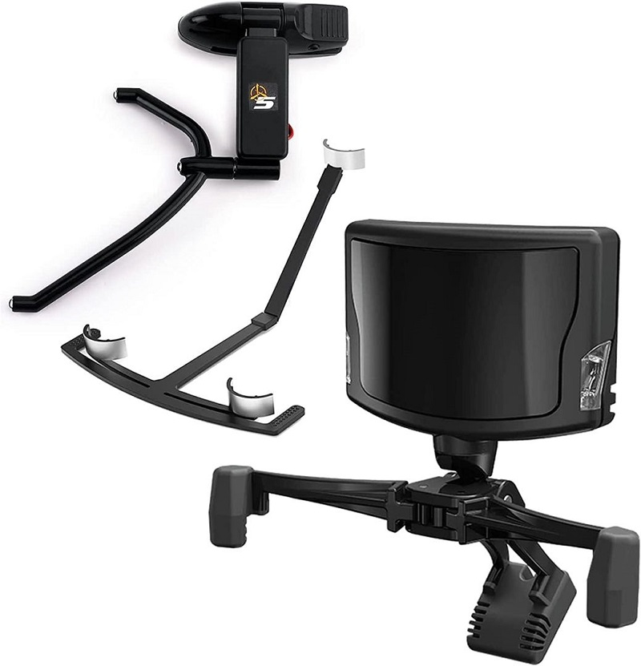
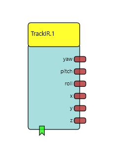

# TrackIR

Component Type: Sensor (Subcategory: Computer Vision)

The TrackIR input component plugin provides an interface to the TrackIR 5 head tracker, see: https://www.trackir.com/
The TrackIR 5 can measure the head orientation in 6DOF (Yaw, Pitch, Roll, X, Y, Z).
This data can be utilized for mouse cursor control and other purposes.

## Requirements

This software component requires the TrackIR device being connected to an USB port, and the TrackIR software running.

## Output Port Description

- **Yaw \[double\], Pitch \[double\], Roll \[double\]:** These output ports provide current yaw, pitch and roll rotation values (the range of the values depends on the speed settings in the TrackIR software).
- **X \[double\], Y \[double\], Z \[double\]:** This output port provides the X, Y and Z translation values (the range of the values depends on the speed settings in the TrackIR software).

## Event Listener Description

- **start:** An incoming event on this port starts the TrackIR data output.
- **stop:** An incoming event on this port stops the TrackIR data output.
- **center:** An incoming event on this port sets the TrackIR coordinates to 0 (the user should look straigt to the middle of the screen in order to get a correct center position).

## Properties

- **autoStart \[boolean\]:** This property specifies if the data output is started automatically (if value is true) or if of a start event must be sent via the dedicated event listener port (if value is false).
- **pollingIntervar \[integer\]:** This property defines the polling-interval (update-interval) for getting sensor value updates (given in milliseconds), for example: a value of 10 results in 100 updates per second. The maximum update rate for the TrackIR 5 is 125 Hz (8 ms)
