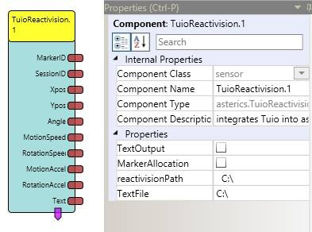
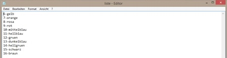

##

## TuioReactivision

# TuioReactivision

### Component Type: Sensor (Subcategory: Sensor Modules)

This component integrates reacTIVision into AsTeRICS

  
TuioReactivision plug-in

## Requirements

This component requires that the reacTIVision.exe is running --> Download: http://reactivision.sourceforge.net/. It can either be started manually, with the ApplicationLauncher plug-in or via a reference in the tuioReactivision plug-in's property "reactivisionPath"

## Output Port Description

- **Marker ID \[Integer\]:** The fiducial marker's ID
- **Session ID \[Float\]\]:** Temporary object ID
- **xPos \[Float\]:** The marker's position on the x-axis
- **yPos \[Float\]:** The marker's position on the y-axis
- **angel \[Float\]:** The marker's angle
- **motion speed \[Float\]:** Movement vector which shows the marker's motion speed
- **rotation speed \[Float\]:** Rotation vector which shows the marker's rotation speed
- **motionAccel \[Float\]:** The marker's motion acceleration
- **rotationAccel \[Float\]:** The marker's rotation acceleration
- **Text \[String\]:** Sends the text assigned to the marker which is recognised on the display

## Properties

- **Text Output \[Boolean\]:** If it is true, a string can be assigned to a marker. Therefor, a text file is necessary
- **Marker Allocation \[Boolean\]:** If it is true, an event port can be assigned to a marker. Therefor, a text file is necessary. Only Text Output or Marker Allocation can be true
- **reactivisionPath \[Boolean\]:** Contains the path to the reacTIVision.exe
- **Text File \[String\]:** Contains the path of the text file in which the marker is either assigned to a text or an event port (e.g. "1-3" marker three is assigned to event trigger one )

  
Examplary text file when a marker should be assigned to a string (Marker number is on the left side)

  
Examplary text file ehen a marker should be assigned to an integer (Marker number is on the right side)

## Event Trigger

- **Event Trigger** Port 1-6 can only be used when marker allocation is true.
