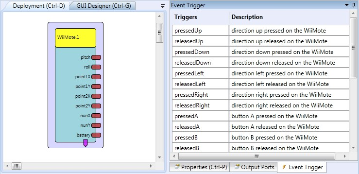

##

## WiiMote

# WiiMote

### Component Type: Sensor (Subcategory: Standard Input Devices)

The WiiMote component interfaces to the Nintendo WiiMote controller via Bluetooth and the WiiYourself! library. It provides various sensor values including the Wiimote buttons and the tracked IR-points of the Wiimote IR front camera and the Joystick position of the Nunchuk extension.

Contains WiiYourself! wiimote code by gl.tter - see [http://gl.tter.org](http://gl.tter.org)

For Wiimote connection and pairing, please see e.g. [here](http://code.google.com/p/giimote/wiki/GettingConnected).

  
WiiMote plugin

## Requirements

A Wiimote controller has to be available and paired with the Bluetooth radio module of the system.

  
WiiMote and Nunchuk

## Output Port Description

- **pitch \[integer\]:** The calculated pitch orientation of the Wiimote controller (in degrees)
- **roll \[integer\]:** The calculated roll orientation of the Wiimote controller (in degrees)
- **point1X \[integer\]:** The X position of the first visible IR point (0-1023)
- **point1Y \[integer\]:** The Y position of the first visible IR point (0-768)
- **point2X \[integer\]:** The X position of the second visible IR point (0-1023)
- **point2Y \[integer\]:** The Y position of the second visible IR point (0-768)
- **nunX \[integer\]:** The X-position of the analog joystick on the Nunchuk extension (if connected)
- **nunY \[integer\]:** The Y-position of the analog joystick on the Nunchuk extension (if connected)
- **battery \[integer\]:** The battery level (0-100%)

## Event Trigger Description

- **pressedUp:** Up direction button pressed
- **releasedUp:** Up direction button released
- **pressedDown:** Down direction button pressed
- **releasedDown:** Down direction button released
- **pressedLeft:** Left direction button pressed
- **releasedLeft:** Left direction button released
- **pressedRight:** Right direction button pressed
- **releasedRight:** Right direction button released
- **pressedA:** A direction button pressed
- **releasedA:** A direction button released
- **pressedB:** B direction button pressed
- **releasedB:** B direction button released
- **pressed1:** 1 direction button pressed
- **released1:** 1 direction button released
- **pressed2:** 2 direction button pressed
- **released2:** 2 direction button released
- **pressedPlus:** Plus direction button pressed
- **releasedPlus:** Plus direction button released
- **pressedMinus:** Minus direction button pressed
- **releasedMinus:** Minus direction button released
- **pressedHome:** Home direction button pressed
- **releasedHome:** Home direction button released
- **pressedNunchuckC:** NunchuckC direction button pressed
- **releasedNunchuckC:** NunchuckC direction button released
- **pressedNunchuckZ:** NunchuckZ direction button pressed
- **releasedNunchuckZ:** NunchuckZ direction button released

## Properties

- **updatePeriod \[integer\]:** This property defines how often the WiiMote is queried for new data (in milliseconds)
