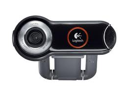

# XFacetrackerLK

### Component Type: Sensor (Subcategory: Computer Vision)

OS: Windows (x86, x64), Linux (x86, x64, RPi3), Mac OSX

This component provides a cross-platform face tracking computer vision algorithm which puts out estimated movement of a user's nose and chin in x and y coordinates. The underlying mechanism builds upon the [JavaCV library][1] for frame grabbing and computer vision processing. In particular a trained cascade of haar-like features is used in combination with a Lukas Kanade optical flow algorithm to track a face and its movement. The x- and y- coordinates can be used in camera-mouse configurations or to enable selection or control tasks. The values are only provided if a face can be tracked by the algorithm. Note that the x- and y- values represent relative movement in pixels and have to be accumulated (e.g. via the integrate component) to generate e.g. absolute mouse positions.

## Requirements

A camera has to be available (this can be any webcam or a camera which is available as image acquisition device via the operating system). The picture below shows the Logitech Webcam 9000 Pro. Also the camera device of a Kinect sensor or PS3Eye should work. Furthermore, a video stream of an IP camera can be used for tracking.

  
Logitech Webcam 9000 Pro

### Note for Raspberry Pi

The plugin can be used on a Raspberry Pi 3 (tested with Raspbian Jessie) with USB cameras, the Kinect camera or the [Raspberry Pi camera module][2].

In order for the raspi cam to work, the following steps are necessary:

1.  Enable the camera with

    sudo raspi-config

2.  Add the v4l driver for the camera, to make it accessible as /dev/videoXX device:

    sudo modprobe bcm2835-v4l2 max_video_width=2592 max_video_height=1944

## Output Port Description

- **noseX \[integer\]:** This value specifies the relative change in the x coordinate of the user's nose with respect to the previous image frame.
- **noseY \[integer\]:** This value specifies the relative change in the y coordinate of the user's nose with respect to the previous image frame.
- **chinX \[integer\]:** This value specifies the relative change in the x coordinate of the user's chin with respect to the previous image frame.
- **chinY \[integer\]:** This value specifies the relative change in the y coordinate of the user's chin with respect to the previous image frame.

## Event Listener Description

- **init:** if this event is triggered, the face recognition procedure is initiated. This can be useful if the correct face position has been lost due to drifting of the LK algorithm.
- **showCameraSettings** an incoming event displays the settings window for the camera device (only on Windows), where parameters like image brightness or contrast can be adjusted.

## Properties

- **frameGrabber\[string, combobox selection\]:**Name of FrameGrabber to use (Default, VideoInput, OpenCV, FFmpeg, OpenKinect, PS3Eye, IPCamera).
- **frameGrabberFormat\[string\]:**Format for grabber, e.g. FFmpeg: 'dshow' (default), 'vfwcap', 'gdigrab'.
- **deviceList \[string, combobox selection\]:**List of available devices, if supported by grabber
- **cameraSelection \[string\]:** The camera device to be used - use camdIdx e.g. '0' (VideoInput, OpenCV, OpenKinect, PS3Eye), or camName e.g. 'video=Integrated Camera' or 'desktop' (FFmpeg), stream-url for IPCamera.
- **cameraResolution \[string, combobox selection\]:** This selection box provides several standard camera resolutions. Changing the resolution affects accuracy and performance (CPU load of the runtime system). Provided selections include �160x120�, �320x240�, �640x480�, �800x600�, �1024x768� and �1600x1200�.
- **frameRate \[integer\]:**The frame rate to use for frame grabbing. In case of 0 or a negative value, the maximum frame rate will be used.
- **titleVideoFrameWindow \[string\]:**The title of the window showing the video frame.
- **displayGUI \[boolean\]:**if selected, the GUI window will be shown.
- **enableOverlaySettings \[boolean\]:**if selected, the video frame shows the current frame rate and device name as overlayed text.

## Example Configuraitons

### Default

Selects the best frame grabber for the platform the ARE is running on. (Linux: FFmpeg, Mac OSX: OpenCV, Windows: VideoInput)

Configuration

- frameGrabber:Default
- cameraSelection:0

### OpenCV

- frameGrabber:OpenCV
- cameraSelection:0

### VideoInput (Windows only)

- frameGrabber:VideoInput
- cameraSelection:0

### FFmpeg (Linux only)

- frameGrabber:FFmpeg
- frameGrabberFormat (optional): e.g. vfwcap or dshow
- cameraSelection (device name or device number): e.g. /dev/video0 or 0 (will be mapped to /dev/video0)

### MJPEG stream of SmartPhone camera

Install the following Android app on your smartphone and start streaming the front camera: [Camera Stream - WiFi IP Webcam (Web Host LLC)][3]

Enter the http url displayed at your smartphone and add /video to the url

e.g.

http://192.168.1.100:8080/video

Set the cameraSelection property of the XFacetrackerLK plugin to this url.

Configuration

- frameGrabber:IPCamera
- cameraSelection:http://192.168.1.100:8080/video

[1]: https://github.com/bytedeco/javacv
[2]: https://www.raspberrypi.org/products/camera-module-v2/
[3]: https://play.google.com/store/apps/details?id=com.vinternete.camerastream
