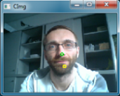

# Camera Mouse Solution

## Objective

Mouse control (moving mouse cursor, clicking and dragging) by head movements.

## Description

By moving the head up/down or left/right the mouse cursor should move accordingly. A left click is performed by dwelling (stopping movement and waiting for some time). To do a right, double or drag click select the respective button in the ARE GUI and move the cursor to the location where the click should be performed at. The camera device, the mouse speed and other settings can be changed by clicking onto the ```Settings``` button. Additionally, external switches can be configured for clicking and an on-screen keyboard of choice can be defined.



## Requirements

* Integrated Webcam or USB camera
* AsTeRICS installed and ARE running
* OS: Windows, Linux (incl. RPi), Mac OSX

## Related Videos

<b-embed type="iframe" aspect="16by9" src="https://www.youtube-nocookie.com/embed/P9qJAWegkFM" allowfullscreen/>

## Major Plugins

* [XFacetrackerLK](/plugins/sensors/XFacetrackerLK)
* [Mouse](/plugins/actuators/Mouse)

## Related Tutorials

[Model Creation - Camera Mouse Simple](/customize/Model-Creation)