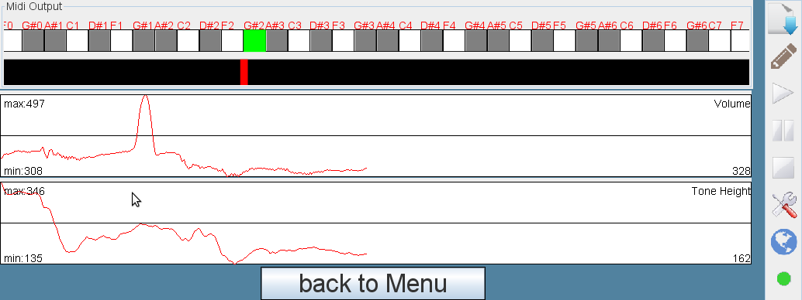

# Head Sound Solution

## Objective

Generate sounds according to head movement.

## Description

By moving the head left/right, the tone scale should go up and down accordingly. Additionally, by moving the head up/down, the volume can be changed.

## Requirements

* Integrated Webcam or USB camera
* AsTeRICS installed and ARE running
* OS: Windows, Linux (incl. RPi), Mac OSX

## Major Plugins

* [XFacetrackerLK](/plugins/sensors/XFacetrackerLK)
* [MidiPlayer](/plugins/actuators/MidiPlayer)