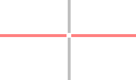

# Switch Mouse Solution

## Objective

Mouse control by switch input. Instead of a mouse cursor a cross scanning from the top to the bottom and from the left to the right is used.

## Description

By pressing the right ```cursor key``` the cross should move accordingly from the left to the right as long as you keep the key pressed. Subsequently, press the left ```cursor key```to move the cross from the top to the bottom. As soon as the key is released the the left click is performed by dwelling (stopping movement and waiting for some time). You can switch the click modality by pressing the left and right ```cursor keys``` simultanously.



## Requirements

* Switch
  * Keyboard key (```Cursor left```, ```Cursor right```) or
  * external Switch (e.g. [FABI](https://www.asterics-foundation.org/projects/fabi/)) attached and configured to emulate ```Cursor left```and ```Cursor right``` keys.
* AsTeRICS installed and ARE running
* OS: Windows, Linux (incl. RPi), Mac OSX

## Major Plugins

* [KeyCapture](/plugins/sensors/KeyCapture)
* [Mouse](/plugins/actuators/Mouse)