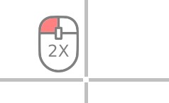

# Switch Mouse Solution

## Objective

Mouse control by switch input. Instead of a mouse cursor a cross scanning from the top to the bottom and from the left to the right is used.

## Mouse movement

By pressing the `right` cursor key the cross should move accordingly from the left to the right as long as you keep the key pressed. Subsequently, press the `down` cursor key to move the cross from the top to the bottom. As soon as the keys are released, the left click is performed by dwelling (stopping movement and waiting for some time).


*Fig. 1: Crosshair cross indicating the current mouse position. Red horizontal line indicating a movement from top to bottom.*

## Tooltips

In order to perform special clicks there are so called "tooltips". Press `right` and `down` cursor keys simultaneously in order to show the tooltips, which look like this:



*Fig. 2: Tooltip next to the crosshair, shows symbol for double click*

By pressing one of `right` or `down` cursor keys again it's possible to navigate through the tooltips where functions like double click, right click, dragging or keyboard shortcuts like `Ctrl + C` and `Ctrl + V` can be chosen.


## Requirements

* Switch
  * Keyboard key (```Cursor left```, ```Cursor right```) or
  * external Switch (e.g. [FABI](https://www.asterics-foundation.org/projects/fabi/)) attached and configured to emulate ```Cursor left```and ```Cursor right``` keys.
* AsTeRICS installed and ARE running
* OS: Windows, Linux (incl. RPi), Mac OSX

## Major Plugins

* [KeyCapture](/plugins/sensors/KeyCapture)
* [Mouse](/plugins/actuators/Mouse)
* [CrosshairCursorControl](/plugins/actuators/CrosshairCursorControl)
* [Tooltip](/plugins/actuators/Tooltip)