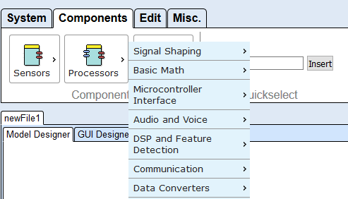

# Create and Edit a Model

To create a new model, add one or several components. To do so, select the tab Components, and from the sub-menu select a group of components, depending on what is supposed to be added. The three component groups are _Sensors_, _Processors_ and _Actuators_.  
Within these sections, the components are devided into subsections, making it easier to find one plugin out of the huge amount of available plugins.

The Components Tab

Now, this added component can be manipulated in the drawing area or the List View. This can be done with the functions in the Edit-tab or directly by using the mouse and/or the keyboard.

## Model Manipulation via Mouse

After a component has been added to the drawing field, it can be moved by using the drag and drop functionality. Several elements (components, channels, eventchannels) can be selected by drawing a selection rectangle (just press the left mouse button and move the mouse) or by pressing the _Ctrl_\-Key and clicking on each element.  
All the selected elements can be moved using drag and drop. All selected components are marked with a grey rectange in the background. If only one component is selected it's properties can be edited in the property editor. The same applies when an event channel is selected. Channels can be drawn by pressing the mouse button over an output port and dragging the channel to an input port.  
Connecting eventchannels works in the same way.

Selection of Components

## Model Manipulation via Keyboard

A dedicated keyboard mode can be activated by pressing Enter when the drawing area is selected. From then on the components can be navigated by using the arrow keys or moved by using Shift-Arrow. Pressing the Space bar activates port mode, thus enabling the user to navigate the ports of the selected component via the arrow keys. Pressing Shift-Space on an output port starts drawing a new channel. The user must then navigate to a matching input port on another component and press Shift-Space there to complete the channel. Esc ends port mode.  
When in port mode, the user can activate channel mode by pressing the Space bar again. Now the channels connected to the selected port can be navigated. Esc ends channel mode.

## Selection

It is possible to select several components, channels and event channels at the same time. The selection can be done with the mouse (by dragging a selection rectangle) or by the usage of the _Ctrl_\-key, like in many standard programs. The selected components are marked with a grey frame. The figure below shows a model with several selected components.

Model with three selected components