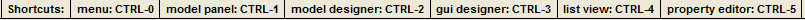
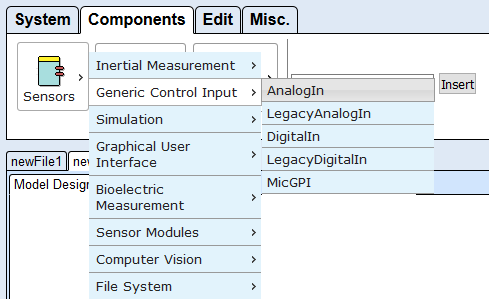

# Keyboard Control

The WebACS is fully accessible via keyboard. The following sections describe the usage in the different parts of the ACS.

## Shortcuts

The shortcut menu right at the top of the screen (see picture below) gives the user the chance to jump directly to one of the subsections of the page, thus making keyboard navigation much faster.

WebACS shortcut menu

## Menu

After jumping to the menu with _CTRL-0_, the menu tabs can be switched by using the _arrow_ keys. Once the desired tab is active, the menu items can be reached via the _Tab_ key. When one of the component menus in the Components tab is selected, it can also be navigated by using the _arrow_ keys.

The menu after opening a components submenu

## Model Panel

After jumping to the model panel with _CTRL-1_, the _arrow_ keys can be used to switch between the models.

## Model Designer

After jumping to the model designer with _CTRL-2_, the user can enter keyboard mode by pressing _Enter_. Now the components can be navigated by using the _arrow_ keys or moved by using _Shift-Arrow_.  
Pressing the _Space_ bar activates port mode, thus enabling the user to navigate the ports of the selected component via the _arrow_ keys. Pressing _Shift-Space_ on an output port starts drawing a new channel. The user must then navigate to a matching input port on another component and press _Shift-Space_ there to complete the channel. _Esc_ ends port mode.  
When in port mode, the user can activate channel mode by pressing the _Space_ bar again. Now the channels connected to the selected port can be navigated using the _arrow_ keys. _Esc_ ends channel mode.

The Model Designer in port mode

## GUI Designer

After jumping to the GUI Designer with _CTRL-3_, the user can enter keyboard mode by pressing _Enter_. Then the user can navigate the elements by using the _arrow_ keys. _Shift-arrow_ keys moves the selected element, _Alt-arrow_ keys resizes the selected element.

The GUI Designer in keyboard mode

## List View

After jumping to the List View with _CTRL-4_, the user can enter keyboard mode by pressing _Enter_. Then the user can navigate the elements by using the _arrow_ keys. _Space_ activates port mode, so that the ports of the selected components can be navigated by using the _arrow_ keys. _Esc_ ends port mode.  
When in port mode, the user can activate channel mode by pressing the _Space_ bar again. Now the channels connected to the selected port can be navigated using the _arrow_ keys. _Esc_ ends channel mode.

List View in channel mode

## Property Editor

After jumping to the Property Editor with _CTRL-5_, the user can switch the tabs of the Property Editor by using the _arrow_ keys. All other elements can be reached by using the _Tab_ key in the same way as on any website.

Property Editor with open dropdown