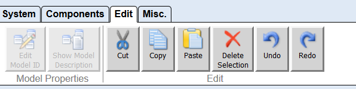

---
title: The Edit Tab
--- 

# The Edit Tab

The edit tab is used for manipulating the components and their interconnections. The list below provides a detailed description of the available operations found on the Edit Tab as shown in the figure.

The Edit Tab

Description of the _Model Properties_ Group:

*   _Edit Model ID (not yet implemented)_ edits the unique model ID. This ID is generated automatically and is used by the ARE to store model based information belonging to the editing model.
*   _Show Model Description (not yet implemented)_ shows the model description dialog, allowing the user to edit the model description. The description is divided into three parts: _Short Description_, _Model Requirements_ and _Detailed Description_

Description of the _Edit_ Group:

*   _Cut_ cuts out the selected elements and stores them to clipboard.
*   _Copy_ copies the selected elements to the clipboard.
*   _Paste_ copies the elements from the clipboard to the drawing field.
*   _Delete Selection_ deletes the selected elements. This can also be done with the delete-key.
*   _Undo_ the last editing action like move a component, add/delete a component or also the channel and event channel operations. Setting properties and events (things done in the property window) are excluded form undo.
*   _Redo_ the last editing action that has been undone with _Undo_. Setting properties and events (things done in the property window) are excluded form redo.

After at least two components have been added to the deployment, they can be connected to each other. A connection always has to start at an output port (right hand side of a component) connecting to an input port (left side of a component). One output port can be connected to several input ports, but an input port can only receive data from one output port. Additionally the data types of the ports must match in order to be able to connect them (see the section on Channels).